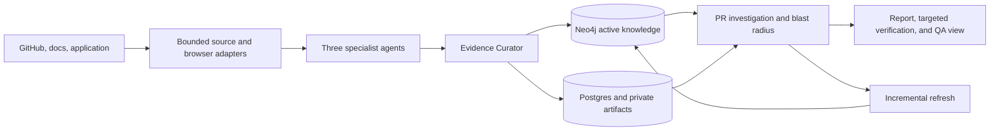
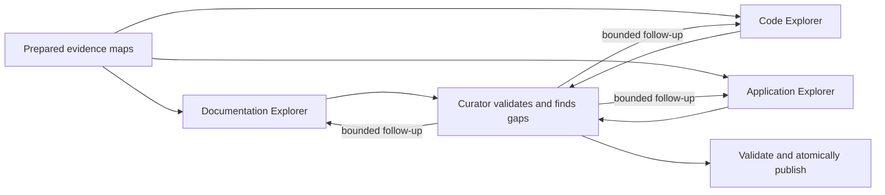
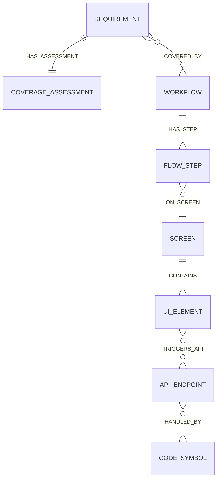
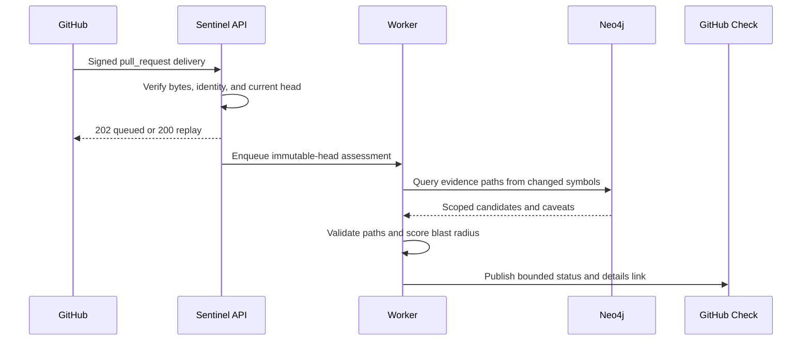

# Sentinel: evidence-grounded blast-radius analysis for agentic testing

**Design document for the Testsigma AI Engineer assignment**  
**Reference target:** [Hi.Events](https://github.com/HiEventsDev/Hi.Events)  
**Reference change:** [PR #1338](https://github.com/HiEventsDev/Hi.Events/pull/1338)  
**Revision reviewed:** 2026-09-09

The four Mermaid figures have a self-contained accessible
[HTML companion](docs/delivery/diagrams.html) for wide-screen review. Its light
palette is derived from Sentinel's local white, ink, green, and gray design
tokens; low-level storage fields and retry branches remain in prose to keep each
figure within its visual complexity budget.

## Executive position

Sentinel answers a narrow question: given product intent, an observed application,
its source, and a real pull request, what product behavior deserves regression
attention and why? The useful output is not a plausible paragraph. It is a set of
product-facing findings whose path back to documents, browser observations,
endpoints, and code can be inspected.

The core design choice is to give models discretion over **where to investigate**
while keeping deterministic code authoritative over **what may be read, what is
evidence, what enters the graph, what may be retried, and what counts as impact or
verification**. Three specialist agents navigate bounded evidence indexes. A
Curator resolves conflicts and gaps through limited follow-up missions. Strict
validators then publish one application- and revision-scoped graph. Pull-request
analysis starts from changed symbols and traverses only evidence-backed paths to
UI, workflows, and requirements.

The implemented depth is deliberately uneven. Source evidence, safe browser
observation, durable specialist execution, graph reconciliation, absence
semantics, immutable PR investigation, deterministic blast-radius scoring,
grounded report delivery, incremental refresh, evaluation, and security controls
receive most of the investment. Trusted-head browser verification is implemented,
but no trusted PR-head deployment was registered or exercised for the sample. The
committed report uses deterministic fallback wording through the product renderer,
and its runtime verification therefore remains `verification_unavailable`. That
is an environmental limitation, not a wording problem to hide.

## 1. Reference target and narrow vertical slice

Hi.Events is a credible three-layer target: a public React/TypeScript frontend, a
PHP/Laravel backend, a live web product, public documentation, and active pull
requests. Sentinel focuses on organizer and admin workflows where browser state,
HTTP requests, frontend code, Laravel routes/actions/services, and product intent
can form one inspectable path. It does not attempt to understand the entire
repository.

PR #1338, “Rework UTM attribution tracking and admin attribution report,” is the
reference change. GitHub records base
`2064f88ff7590e93c738efb8becaa7d732063619`, head
`f68df0dabd18d04df5e6c7e873aac2b5e5201584`, 56 changed files, 2,232 additions,
and 1,238 deletions. The diff changes the admin attribution screen, date and
grouping parameters, request validation, account-source classification,
aggregation, and currency presentation. That gives the sample report a real
cross-stack path without requiring a claim that the whole product was crawled.

Commit alignment is non-negotiable. A graph built from the PR merge commit already
contains the change and cannot serve as the base. A PR assessment stores provider
repository identity, PR ID/number, base SHA, head SHA, graph commit, graph
revision, policy version, and assessment identity. A stale delivery or later head
cannot silently reuse an earlier result.

The reference fixture is sanitized. It includes normalized paths, public source
identities, short human-authored labels, expected facts, positive and negative
links, trajectories, controls, and unknowns. It excludes copied repository files,
credentials, raw DOM, browser storage, private screenshots, and model reasoning.

## 2. System architecture and trust boundaries

There are four kinds of state:

1. **Operational state in Postgres/Supabase.** Applications, onboarding
   configuration, secret references, runs, leases, interrupts, events,
   assessments, artifact metadata, and active graph revision live here. Browser
   roles cannot read the private `sentinel` schema directly; server operations
   repeat owner/application predicates.
2. **Product knowledge in Neo4j.** Stable typed facts and evidence relationships
   are scoped by application and graph revision. Publication stages a pending
   revision, validates it, and switches active identity atomically.
3. **Private artifacts in Supabase Storage.** Screenshots and bounded traces use
   content-addressed, application/run-associated keys in a private bucket. Public
   projections expose artifact IDs; authorized endpoints issue short signed URLs.
4. **Ephemeral rich runtime state.** Git checkouts, ASTs, DOM, Playwright objects,
   raw tool output, provider clients, and prompts are disposable and never become
   checkpoint state.

External inputs are hostile by default. GitHub webhook bytes are authenticated
before parsing. Repository access is read-only and pinned to an immutable object;
tree preflight, file/depth/byte limits, safe symlink policy, and blob identity
checks happen before text reaches an indexer. Documentation uses HTTPS/root/path
allowlists, A/AAAA public-address checks, a DNS-pinned dispatcher, manual redirect
validation, and byte/page/time limits. Browser traffic uses an exact HTTP and
WebSocket origin policy. Model inputs/outputs use strict bounded schemas and reject
secret-shaped keys and values.

The control plane is a Next.js application. It acknowledges long work with a run
ID and reads durable state instead of simulating progress. The worker owns leases,
heartbeats, cancellation, cleanup, and handler dispatch. The repository includes
the worker boundary but not the final production `createRunGraphs` assembly; the
submission demo therefore uses deterministic in-memory fixture services.



## 3. Agent decomposition: decisions versus authority

This is not one long prompt. Each stage has a narrow question, bounded tools, a
typed result, and an explicit authority boundary.

| Stage                  | Model-driven responsibility                                                                       | Deterministic authority                                                                                                               |
| ---------------------- | ------------------------------------------------------------------------------------------------- | ------------------------------------------------------------------------------------------------------------------------------------- |
| Source preparation     | None                                                                                              | Fetch immutable inputs; parse documents, TS/React, PHP/Laravel, routes, endpoints, diffs, and browser observations into stable facts  |
| Documentation Explorer | Choose which approved page/section answers the mission; propose atomic requirements               | Approved document map, exact citations, schema, scope, duplicate and budget checks                                                    |
| Code Explorer          | Choose which symbol/edge/slice to inspect; propose implementation paths and unresolved boundaries | AST/route indexes, exact source ranges, relationship validation, language/path/line budgets                                           |
| Application Explorer   | Choose among opaque observed actions and decide when the mission has enough evidence              | Exact-origin browser policy, state-bound action identity, destructive-action denial, transition/network capture, replay rules         |
| Evidence Curator       | Compare proposals, identify conflicts/gaps, request bounded follow-ups, abstain                   | Evidence tiers, link-type rules, source/run/revision compatibility, round and total budget                                            |
| Publication            | None                                                                                              | Validate the complete pending fact/link/coverage batch and atomically advance the active revision                                     |
| PR investigation       | Choose bounded follow-up reads from changed symbols                                               | Immutable base/head diff, symbol overlap, graph query scope, evidence-path validation                                                 |
| Blast radius           | None                                                                                              | Normalize paths, exclude stale/conflicted/Tier-D claims, aggregate targets, score risk and evidence separately                        |
| Report wording         | Select only among bounded supplied wording choices                                                | Exact fact/claim/citation subset validation, deterministic fallback, immutable persistence, API/dashboard, and GitHub check           |
| Dynamic verification   | Adapt within a fixed mission and request at most one named evidence-gap follow-up                 | Revalidated head identity, setup/control classification, deterministic checkpoints/verdicts, total budget, retention, and publication |
| Incremental refresh    | Choose bounded follow-up investigation for changed or stale scope                                 | Commit ancestry, invalidation/reuse, coverage recomputation, pending validation, and atomic active-revision switch                    |

All three specialists use the same LangGraph kernel. A kernel configuration fixes
agent identity, allowed mission modes, prompt/model/toolset/validator versions,
no-progress limit, recursion limit, and budget. Its fingerprint is checkpointed,
so a resumed thread cannot silently change tools or prompts. A model decision
selects a described tool; the tool registry then independently checks mission,
agent, mode, exact schema, scope, call identity, preflight cost, and remaining
budget.

Tool execution is idempotent by mission/call/request hash. Completed output and
budget settlement are checkpointed together. A repeated call with the same
identity returns its committed result; a conflicting request fails. Provider and
event failures can retry around committed state without repeating the underlying
effect. Uncertain browser mutations are different: they are marked non-replayable
and require a human decision.

The Curator is not a fourth omniscient agent. It sees validated compact proposals
and conflicts, not unrestricted source/DOM. It can request a limited mission such
as “verify which observed control triggers this normalized endpoint.” It cannot
write arbitrary graph edges. Reconciliation stops at its round/budget limit and
publishes ambiguity or coverage gaps instead of looping toward artificial
certainty.



## 4. Knowledge graph schema and why it is shaped this way

The graph preserves facts rather than a single generated narrative. The primary
node types are:

- `DocumentSource`, `DocumentPage`, and `DocumentSection` for cited intent;
- `Requirement` and `Capability` for atomic, testable product expectations;
- `Workflow` and `FlowStep` for ordered user behavior;
- `Screen` and `UIElement` for observed semantic UI state;
- `FrontendRoute`, `APIEndpoint`, `CodeFile`, `CodeSymbol`, `DomainEntity` for
  implementation;
- `PullRequest`, `CoverageAssessment`, and evidence/conflict records for change
  and epistemic state.

Important relationships include `STATES`, `REQUIRES`, `COVERED_BY`, `HAS_STEP`,
`NEXT`, `ON_SCREEN`, `ACTS_ON`, `CONTAINS`, `MATCHES_ROUTE`, `RENDERED_BY`,
`BINDS`, `TRIGGERS_API`, `CALLS_API`, `HANDLED_BY`, `CALLS`, `READS`, `WRITES`,
`CHANGES`, and `HAS_ASSESSMENT`. Relationship type and direction come from fixed
allowlists; values are bound parameters. Every accepted edge carries evidence
IDs, provenance, extraction method, tier, review state, application, and revision.



Stable identity is content-derived from canonical structured fields. A code
symbol includes repository, commit, language, qualified name, file path, and
range. A runtime element uses the application, screen, semantic role/name, and
context fingerprint; private selectors are not public identity. Stable IDs make
repetition comparisons and unchanged-fact reuse possible without pretending two
different commits are identical.

### Absence is an assessment, not a missing node

A missing edge is ambiguous: perhaps the feature is absent, perhaps the crawler
did not reach it, authentication blocked it, the requirement is not testable in
UI, evidence is stale, or reconciliation has not run. Sentinel therefore stores
a versioned `CoverageAssessment` for each requirement and completed exploration
scope. Status is one of:

- `observed`: a complete eligible evidence path exists within scope;
- `partially_observed`: some required checkpoints/path segments exist;
- `not_observed`: the completed scope did not contain expected UI evidence;
- `blocked`: auth, environment, test data, or policy prevented observation;
- `ambiguous`: evidence conflicts or multiple mappings need review;
- `not_evaluated`: no completed compatible scope can support a conclusion.

The assessment records mission/workflow/screen/route scope, environment state,
reason code and wording, evidence/attempt IDs, possible causes, reviewer actions,
source/crawl/auth revision context, run, graph revision, and evaluation time. This
lets the product say “not observed in checkout after an authenticated completed
mission” rather than “feature does not exist.” True feature absence is a stronger,
reviewed conclusion that can be built on top of this evidence, not inferred from
null traversal.

The blast-radius query starts from each changed symbol and traverses fixed
relationship patterns toward endpoint/frontend/UI/workflow/requirement targets
inside one application and active revision. Candidate paths containing stale,
foreign, conflicted, pending-review, invalid-direction, cyclic, over-depth, or
Tier-D edges become caveats, not confident findings. That query is why provenance
belongs on edges and coverage is an explicit node: the system must return both a
path and the reason a potential path was excluded.

## 5. Confidence and ambiguity without fake probabilities

Sentinel does not output “92% confident.” The current data cannot justify a
calibrated probability, and a similarity score is not a probability of truth.
Instead, confidence has orthogonal dimensions:

- **Evidence tier.** Tier A is direct deterministic observation/structure; Tier B
  is corroborated deterministic mapping; Tier C is a semantic candidate requiring
  review; Tier D is weak/unresolved and cannot support confident traversal.
- **Review state.** An edge can be not required, pending, accepted, or rejected.
- **Freshness and scope.** Application, run, commit, graph revision, auth state,
  and crawl scope must be compatible.
- **Coverage status.** Observed, partial, not observed, blocked, ambiguous, and not
  evaluated remain distinct.
- **Risk versus evidence.** Consequence/criticality determines risk; evidence tier
  determines support. High-risk Tier-C and low-risk Tier-A are both meaningful.

Deterministic links such as changed-line overlap, runtime request to normalized
endpoint, Laravel route to exact action, or recorded source call can enter Tier
A/B when their identities agree. Semantic requirement-to-workflow or UI-to-code
name similarity remains Tier C/D until corroborated or reviewed. A model cannot
promote its own assertion.

The system asks a human when two plausible semantic targets remain, supporting
and contradicting evidence coexist, required authentication/safety scope changes,
or a non-idempotent browser effect may have occurred. An interrupt contains a
bounded question and IDs, not chain-of-thought. Resume requires an authorized
matching decision on the same thread.

Unknown PR impact is similarly explicit. If a changed symbol has no eligible
product path, the result is an `unknown` finding with Tier D evidence and no
invented target/scenario. Unmapped changes cannot disappear from summary counts.

## 6. Pull-request reasoning and report contract

GitHub App ingestion validates the HMAC-SHA256 signature over exact request bytes,
delivery ID, event/action, installation, repository, sender, PR, timestamps, and
immutable head. It resolves the current PR through the installation before a
transaction records the delivery, creates/reuses the assessment, and enqueues
work. A new head cancels the prior run. Check creation and recovery use the
assessment ID as `external_id`, preventing duplicate checks after partial failure.



The investigation graph groups changed symbols, reuses the active graph, asks the
Code Explorer only for named gaps, requests bounded Curator reconciliation, and
queries candidate paths. Deterministic blast-radius policy combines change
operation/severity, selected-scope criticality, path directness, affected spread,
shared fan-out, corroboration, and unmapped-change state. It produces separate
risk factors, evidence strength, caveats, and structured QA scenarios.

The report a QA lead needs is product-first:

1. Which product areas deserve attention?
2. What changed and why could it matter?
3. What evidence path supports the prediction?
4. What should QA test first?
5. What control can distinguish product failure from environment failure?
6. What is unknown, stale, blocked, or unverified?

`docs/delivery/sample-report-hi-events-pr-1338.json` encodes that shape and a
strict deterministic renderer produces the Markdown artifact. Every area cites
known evidence IDs; unknown references fail generation. The output never says the
PR is safe, never hides unknowns, and never embeds private artifact URLs.

The committed sample is generated from the human-reviewed SNT-033 labels and
public diff metadata, transformed into the real `AssessmentReportView`, and
rendered by the canonical `renderAssessmentReportMarkdown`. It records reference
graph revision 3 and `verification_unavailable`. The report module implements
exact-choice model wording validation and deterministic fallback; storage
persists immutable private Markdown with retry reuse and append-only verification
enrichment; the authenticated dashboard/API provides evidence drill-down,
download, mobile, print, and PDF-ready views; and GitHub checks expose only
bounded summaries.

The sample is intentionally not a persisted live assessment. Its role is to make
the real renderer reproducible without Supabase, Neo4j, or model credentials while
preserving real PR identity and honest unknowns. The fixture dashboard exercises
the same view contract at assessment UUID ending in `0029`.

## 7. Evaluation: deciding which of 100 runs are correct

Evaluation is layered because different failures require different evidence.
Deterministic parsers and graph nodes should be exactly stable; model-driven
investigation can vary in wording and tool order while preserving facts, safety,
and terminal behavior.

The committed golden dataset has development cases for documentation extraction,
link reconciliation, and browser checkpoint behavior plus a held-out whole-graph
PR case. Each case defines inputs, content fingerprint, execution scope, expected
facts and normalized evidence, positive/negative links, citations, paths, impacted
and control targets, visible unknowns, acceptable phased trajectories, forbidden
steps, terminal statuses, budgets, and thresholds. The target receives only input
and execution scope; expected labels stay in the scorer.

Metrics include fact/link precision and recall, F1, evidence-fact accuracy, false
acceptance, citation correctness, unsupported-claim rate, path completeness,
unknown visibility, impacted recall/precision, control false positives, required
trajectory recall, scope adherence, trajectory evidence correctness, efficiency,
terminal correctness, budget adherence, and normalized stability. Empty
denominators have explicit semantics. Unsafe actions, out-of-scope tools,
forbidden steps, critical unsupported claims, and critical negative-link
acceptance are hard failures regardless of average score.

Trajectory phases allow equivalent retrieval order but require phase boundaries.
For example, frontend and backend traces may occur in either order, while both
must follow diff mapping and precede scoring/reporting. Stability hashes canonical
set-like output while preserving path and tool order where order carries meaning.
Prose is excluded from critical fact comparison.

The default baseline runs four cases 100 times, for 400 lightweight executions.
The committed result is 400/400 passing, 100% normalized stability, zero hard
failures, and zero model/provider/tool/browser usage because it replays golden
structured observations. This proves harness conformance, not live-model quality.

Model-backed evaluation requires an estimated record for calls, tokens, reads,
browser actions, elapsed time, and cost plus an exact confirmation token before
the target is invoked. Actual usage is recorded separately. Repetitions report
count, minimum, P50, P95, maximum, mean, and standard deviation; no best run is
selected. A practical 100-run protocol uses 100 deterministic repetitions on
every change, a smaller approved repeated model sample, and a few expensive live
browser cases against a trusted immutable deployment.

A human QA rubric independently scores factual grounding, clarity, actionable
recommendations, uncertainty disclosure, and unsupported-claim control from 1-5.
Any critical unsupported claim, fabricated citation, unsafe action, secret, or
false runtime-verification claim invalidates the report regardless of total.

## 8. Security and resilience

The threat objective is simple: untrusted content may inform evidence but cannot
invoke unauthorized tools/actions/queries or expose credentials. The detailed
model is in `docs/security/threat-model.md`.

Controls are layered at the boundary that owns authority. GitHub uses least
privilege (Contents read, Pull requests read, Checks write), exact-byte webhook
HMAC, delivery idempotency, and current-head checks. Git disables system/global
config, prompts, credential helpers, file remotes in production, submodules, and
hooks. Documentation and browser adapters enforce network/origin and resource
policy. Specialist tools are fixed, strict, scoped, budgeted, and coordinated.
Postgres owns leases and atomic state transitions. Neo4j uses allowlisted labels,
relationships, parameters, and revision predicates. Storage rechecks private
bucket/run association before signing.

Failure is typed and redacted. Transient provider/timeouts may retry around a
committed boundary. Duplicate webhooks, commands, tool calls, and events are
idempotent or return a conflict. Cleanup occurs before terminal publication.
Publication failure leaves the prior graph active. Non-idempotent browser
uncertainty never auto-replays.

`pnpm security` scans tracked/untracked non-ignored text for private-key and
current GitHub/OpenAI/AWS token shapes without printing matched values, verifies
sensitive ignore rules, audits production advisories and licenses with expiring
exact exceptions, runs malicious-input tests, and checks deterministic evaluation
artifact drift. High/critical dependency advisories cannot be excepted.

PR code in a Render preview remains hostile even if provider identity proves its
commit. The planning contract requires an exact service/deploy/repository/SHA/origin
and compatibility proof before credential access. The targeted verification graph
revalidates identity before every head browser mission, runs affected scenarios
and an optional control, evaluates deterministic checkpoints, limits one named
gap follow-up, cleans up in `finally`, retains failure evidence privately, and
appends versioned report/check enrichment without erasing predicted findings. No
trusted head deployment is registered for the sample, so the demo correctly stops
at `verification_unavailable`.

Incremental refresh is implemented separately from assessment history. It checks
trusted deployed commit ancestry, plans affected document/code/workflow scope,
reuses unchanged facts, invalidates incompatible reviewed links, runs only needed
specialists and coverage assessment, retains immutable historical report
artifacts, and activates a validated pending revision atomically. Failure or
cancellation leaves the prior active graph and indexed commit unchanged.

## 9. Scope decisions and cuts

### Where the implementation goes deep

1. **Evidence substrates.** Documentation parsing, TS/React ASTs, PHP/Laravel
   parsing, endpoint normalization, PR mapping, and Playwright observations are
   deterministic and independently testable.
2. **Bounded specialist behavior.** Shared durable kernel, narrow tools, replay
   semantics, budgets, and visible structured activity show actual agent design.
3. **Cross-layer reconciliation and absence.** Evidence eligibility, conflicts,
   follow-ups, coverage assessments, and atomic publication address the hardest
   trust problem in the assignment.
4. **Explainable change traversal.** Immutable PR identity and full evidence
   paths make blast-radius output defensible.
5. **Evaluation/security.** Hard-failure metrics, 100-run stability, prompt/tool
   boundary tests, fault recovery, and CI gates make limitations measurable.

### Functional but intentionally shallow

- The control plane has focused onboarding, runs/activity, and knowledge/review
  views rather than a reusable design platform.
- Graph visualization shows selected paths and coverage, not an unrestricted
  graph browser.
- The browser explores bounded workflows; it is not a general autonomous testing
  product.
- Documentation ingestion follows configured roots; it is not a web-scale crawl.
- Render support is one assignment adapter and plan, not a deployment platform.

### Explicit cuts

- Production root graph assembly for the worker.
- A registered public baseline/head Render pair and an executed live provider
  demonstration; deterministic and gated live harnesses exist, but the submission
  does not fabricate an external deployment.
- Languages beyond TypeScript/React and PHP/Laravel.
- Arbitrary target code execution, generated tests, auto-healing, broad visual
  regression, payments, outbound messages, repository writes, and PR comments.
- Statistical calibration or claims that the small golden fixture generalizes.

SNT-029 report delivery, SNT-031 targeted verification, and SNT-032 incremental
refresh are implemented and verified. The clean-clone demo uses fixture ports and
records verification as unavailable because it has no registered external head.

These cuts mean the submission demonstrates the engine and trust boundaries with
deterministic UI fixtures and a validated reference report, not a fully deployed
end-to-end SaaS. That is less polished than implying completion and more useful to
an engineering reviewer deciding what is real.

## 10. What I would build with another week

### 1. Compile and deploy the production root graphs

Wire initialization, PR assessment, report finalization, verification, and refresh
handlers into the worker's `createRunGraphs` assembly with real durable rich-state
stores and service health. Prove a clean Supabase, Aura, Azure, and GitHub App
deployment can progress from onboarding through one immutable report without
fixture ports. This closes the gap between tested modules and an operational
deployment.

### 2. Run the trusted Hi.Events deployment and calibration study

Provision the disposable Render base/head pair, register exact provider identity,
run the implemented affected scenarios plus one control, and retain the first
versioned report enrichment. Repeat the approved model/browser subset, audit
failures with the QA rubric, and record actual cost and variance without selecting
a best run. This turns the honest `verification_unavailable` sample into measured
runtime evidence.

### 3. Validate a second target

Apply the adapter and evaluation contracts to one smaller TypeScript-only public
product and add disagreements to the development set. This tests whether evidence
tiers, absence semantics, and tool budgets generalize without pretending the
current Hi.Events fixture is statistically representative.

I would not spend that week on more UI polish. Production assembly, trusted live
calibration, and cross-target evidence close the remaining credibility gaps.

## 11. Reproduction and review evidence

The clean-clone deterministic path is:

```sh
corepack enable
pnpm install --frozen-lockfile
pnpm delivery:check
pnpm security
pnpm demo:web
```

GitHub Actions owns full format, lint, typecheck, build, unit, integration, agent,
graph, browser, security, delivery, and secret checks. Provider/live tests remain
off by default and require explicit flags and isolated resources.

The final reviewer should treat the following as authoritative:

- `packages/contracts`: cross-process fact, evidence, graph, PR, deployment, and
  run schemas;
- `packages/adapters`: bounded deterministic source/browser/provider adapters;
- `packages/orchestration`: specialist kernel, reconciliation, PR investigation,
  blast-radius and verification planning;
- `packages/storage` plus `supabase/migrations`: operational, artifact, and graph
  persistence boundaries;
- `packages/evaluation` and `docs/evaluation`: golden data, metrics, runner, and
  results;
- `docs/security`: trust/fault model and policy;
- `docs/delivery`: sample report, Loom script, attribution, screenshots, and
  submission checklist.

Sentinel’s final claim is intentionally bounded: the repository demonstrates how
an evidence-grounded agent system can discover a narrow application slice, model
what it did and did not observe, and explain the expected product impact of a real
change. It also shows, in code and tests, where model autonomy stops.

## 12. Primary references

- [Assignment brief](AI%20Engineer%20Updated%20-%20Assignment.md)
- [Hi.Events repository](https://github.com/HiEventsDev/Hi.Events) and
  [PR #1338](https://github.com/HiEventsDev/Hi.Events/pull/1338)
- [GitHub webhook signature validation](https://docs.github.com/en/webhooks/using-webhooks/validating-webhook-deliveries)
  and [GitHub App least-privilege permissions](https://docs.github.com/en/apps/creating-github-apps/registering-a-github-app/choosing-permissions-for-a-github-app)
- [OWASP excessive-agency guidance](https://genai.owasp.org/llmrisk/llm062025-excessive-agency/)
  and [SSRF prevention guidance](https://cheatsheetseries.owasp.org/cheatsheets/Server_Side_Request_Forgery_Prevention_Cheat_Sheet.html)
- [LangChain trajectory evaluation](https://docs.langchain.com/langsmith/trajectory-evals)
  and [repeated evaluation](https://docs.langchain.com/langsmith/repetition)
- [OpenAI contextual evaluation playbook](https://openai.com/index/evals-drive-next-chapter-of-ai/)
- [Supabase local CLI workflow](https://supabase.com/docs/guides/local-development/cli/getting-started)
- [Neo4j JavaScript managed transactions and parameters](https://neo4j.com/docs/javascript-manual/current/transactions/)
- [Azure OpenAI Responses v1 reference](https://learn.microsoft.com/en-us/rest/api/microsoft-foundry/azureopenai/responses)
- [Render preview environments](https://render.com/docs/preview-environments)
  and [Blueprint specification](https://render.com/docs/blueprint-spec)
