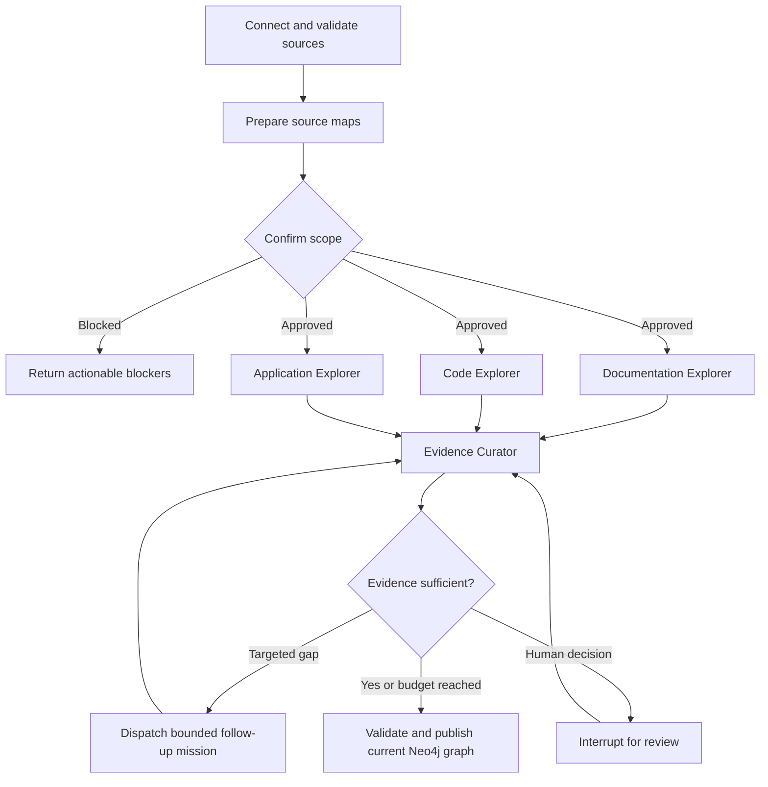
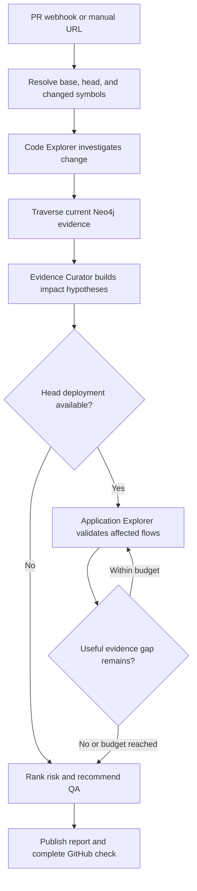
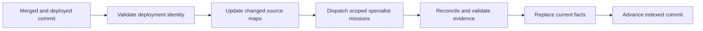
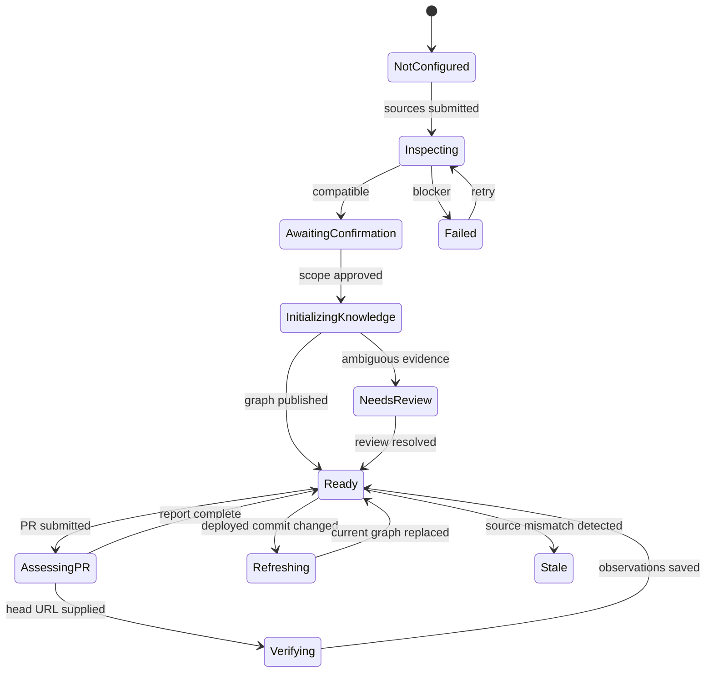
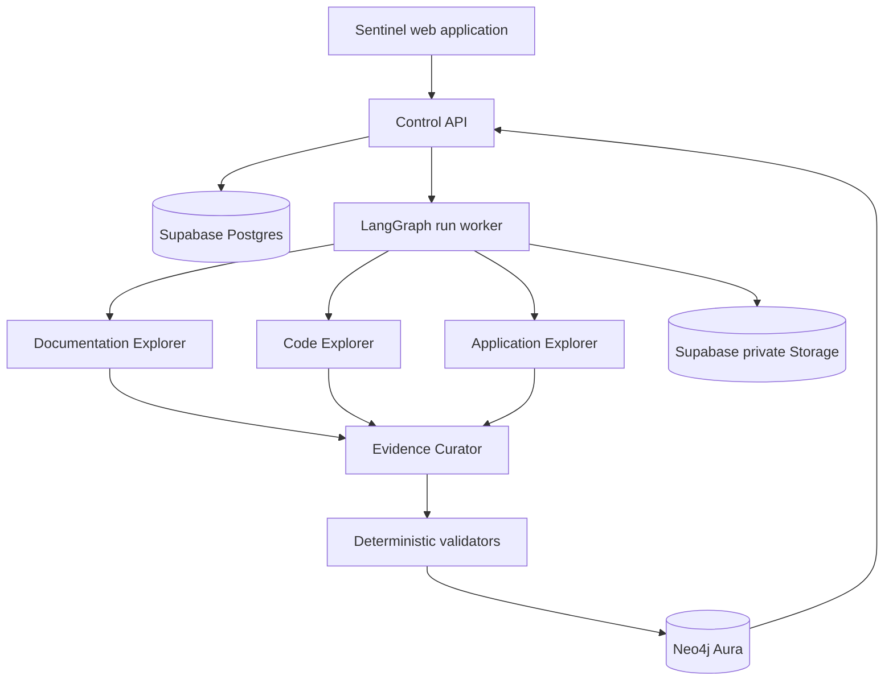
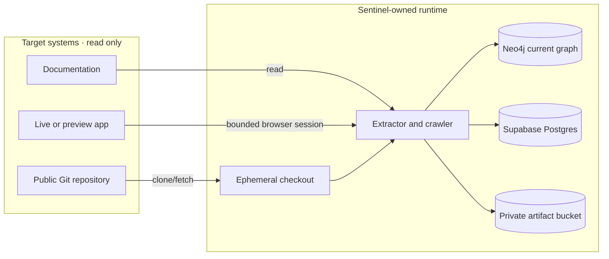
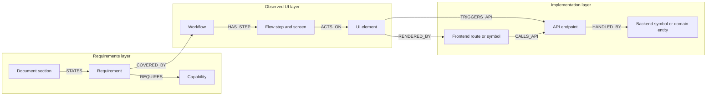
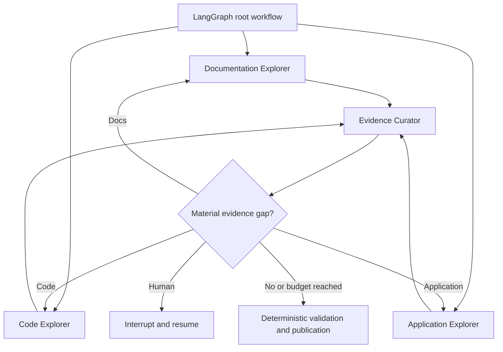
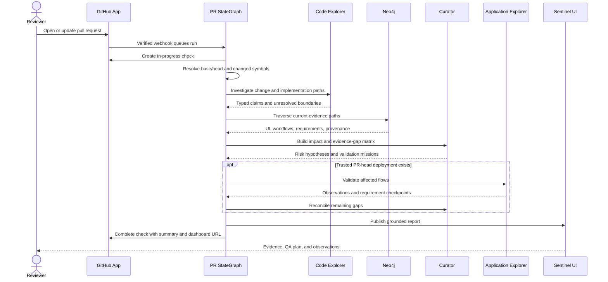

# Sentinel — Product Requirements Document

> Evidence-backed blast-radius analysis for live web applications

| Field | Value |
|---|---|
| Status | Draft — authoritative build specification |
| Product | Sentinel |
| Assignment | Testsigma AI Engineer take-home |
| Primary target | [mohit-nagaraj/Hi.Events](https://github.com/mohit-nagaraj/Hi.Events) |
| Intended readers | Candidate, reviewers, Claude Code, Codex, and future contributors |
| Last updated | 2026-09-06 |
| Source of truth | This document governs implementation decisions unless an explicit decision record supersedes it |

---

## 1. Executive summary

Sentinel is an application-intelligence system that connects three forms of product knowledge:

1. **Intent** — what product documentation says should be possible.
2. **Observed behavior** — what a browser agent can discover in the running application.
3. **Implementation** — which routes, UI components, handlers, API endpoints, controllers, services, and domain entities implement that behavior.

Sentinel builds those connections into a Neo4j evidence graph. When an engineer opens a pull request, Sentinel maps the changed files and symbols into the existing graph, traverses outward to potentially affected screens, user workflows, and requirements, and produces a blast-radius report that a product-aware, non-engineering QA lead can understand.

When a deployment of the PR head is available, Sentinel may also replay the affected workflows with Playwright. This verification supplements the prediction with observed pass, fail, changed, or blocked results. It does not claim that a passing scenario proves the PR safe.

### Product proposition

> Sentinel onboards a live application, its documentation, and its source repository into a current evidence graph; for each PR, it traces changed code to at-risk UI, workflows, and requirements, then optionally verifies the affected paths against a preview deployment.

### Assignment interpretation

The assignment has a five-day submission deadline, but its hard-scope note explicitly states that the intended prototype represents approximately 16 hours of work and asks the candidate to choose depth. Sentinel will therefore demonstrate one deep, coherent vertical slice rather than pretend to support arbitrary applications and programming languages.

The implementation will be deliberately optimized for one public reference target:

- **Application:** Hi.Events
- **Repository:** `https://github.com/mohit-nagaraj/Hi.Events`
- **Supported source stacks:** PHP/Laravel and TypeScript/React
- **Primary domain slice:** event products, attendee checkout, order creation, and organizer order visibility
- **Analysis unit:** one real public pull request whose base and head commits can be reproduced

The architecture will have explicit adapter boundaries so other stacks could be added later, but additional adapters are not part of this assignment.

---

## 2. Why this product should exist

### 2.1 The underlying problem

Product intent, runtime behavior, implementation details, and code changes typically live in separate systems:

- Requirements and feature descriptions live in documentation.
- User journeys exist only in a deployed application and in the knowledge of QA/product teams.
- implementation relationships are buried across frontend and backend source code.
- Pull requests describe code changes, but rarely identify every product behavior that could be affected.

A reviewer can read that a PR changes `CreateOrderHandler.php`, but that alone does not explain:

- which checkout controls depend on it;
- which buyer and organizer workflows share its data;
- which documented requirements may lose coverage;
- which targeted scenarios QA should execute;
- where the system lacks enough evidence to make a reliable mapping.

Conventional code search can find matching names, but it cannot reliably connect differently named concepts across layers. A single unconstrained model prompt can produce a plausible answer, but its claims are difficult to reproduce, audit, or evaluate. A graph built only from static code cannot establish what a user actually observed. A crawl without product requirements cannot explain why a discovered interaction matters.

Sentinel addresses the combined traceability problem.

### 2.2 Desired outcome

For a real PR, Sentinel should be able to explain:

> This PR changes a backend symbol used by `POST /orders`. During the indexed crawl, selecting tickets and submitting attendee details invoked this endpoint. Those steps belong to the attendee checkout workflow, which provides evidence for requirements concerning ticket selection and order creation. These areas should be retested. The link to organizer reporting is weaker and requires review.

Every material assertion in that report should be traceable to evidence such as:

- a documentation excerpt;
- a browser observation;
- a screenshot or accessibility snapshot;
- a runtime network request;
- a route/OpenAPI definition;
- an AST-derived source relationship;
- a specific file, symbol, line range, and commit;
- a reviewed semantic mapping.

---

## 3. Users and jobs to be done

### 3.1 Primary user: QA lead

A QA lead understands the product but should not need to understand the codebase.

**Job:** When a PR changes shared behavior, identify the highest-risk product areas and decide what should be tested first.

**Needs:**

- affected workflows and screens in product language;
- requirements at risk;
- evidence and confidence, not unexplained conclusions;
- recommended validation scenarios;
- a clear distinction between predicted impact and observed verification;
- explicit unknowns and untested scope.

### 3.2 Secondary user: engineer or reviewer

**Job:** Understand why a source change was connected to a product behavior and inspect the technical evidence.

**Needs:**

- base/head commit alignment;
- changed files, symbols, and line ranges;
- graph paths from code to product behavior;
- extraction methods and source references;
- stale or missing mappings;
- the ability to approve or reject uncertain links.

### 3.3 Operator: person onboarding the application

For the take-home, this is the candidate. In a future product it could be an engineering-platform or QA owner.

**Job:** Connect the application once, constrain the crawl safely, confirm its technical compatibility, and initialize the current knowledge graph.

**Needs:**

- normal web onboarding rather than hand-authoring YAML;
- readiness and compatibility feedback;
- explicit crawl boundaries and safe-action controls;
- progress while long-running work executes;
- actionable failures rather than silent partial success.

---

## 4. Product principles

1. **Evidence before inference.** Use exact routes, API observations, AST structure, and source locations before semantic guesses.
2. **Current truth over archive sprawl.** The active graph represents the currently indexed deployment/commit. Historical run metadata and reports are retained compactly; duplicate graph directories and stale facts are not kept in the active graph.
3. **Read-only target access.** Sentinel reads the user's repository and application. It never writes to the target repository, opens branches, changes the default branch, or stores generated artifacts inside that repository.
4. **Narrow and deep.** PHP/Laravel and TypeScript/React are first-class for Hi.Events. Unsupported stacks must be declared, not hand-waved.
5. **Agent-guided discovery over deterministic substrates.** Documentation maps, AST/code indexes, Playwright observations, diffing, safety policy, graph traversal, and test assertions are deterministic evidence-producing systems. Bounded agents decide what evidence to investigate next.
6. **Typed collaboration, not agent conversation.** Documentation, code, and application specialists exchange `DiscoveryMission`, `MissionResult`, and evidence references through a custom LangGraph workflow—not free-form transcripts.
7. **Deterministic authority.** Agents may propose claims and follow-up missions; validators assign evidence tiers, browser policy authorizes actions, deterministic assertions determine verification outcomes, and only the graph writer mutates Neo4j.
8. **Absence is an observation, not proof.** “Not observed within this crawl scope” is valid; “the feature does not exist” is not, unless independently proven.
9. **Predicted impact is not a confirmed defect.** A blast radius identifies risk. Playwright verification may add behavioral observations but cannot establish total safety.
10. **Artifacts must earn retention.** Persist only evidence needed for review, reproducibility, or the final report. Temporary source trees, parser ASTs, and raw patches are disposable.
11. **Every automated boundary may abstain.** Low evidence, stale baselines, unsupported syntax, blocked authentication, and missing preview deployments produce explicit statuses and human actions.
12. **The graph constrains the model.** Agents navigate and explain evidence-backed facts; they do not replace the knowledge graph or invent unsupported dependencies.

---

## 5. Goals, non-goals, and success definition

### 5.1 Goals

#### G-1 — Discover live application workflows

A bounded Application Explorer autonomously investigates Hi.Events missions through policy-gated Playwright actions and captures structured UI states, interactive elements, screenshots, transitions, and runtime network evidence.

#### G-2 — Discover and ingest product intent

A bounded Documentation Explorer navigates the supplied documentation hierarchy, follows relevant approved links, and iteratively extracts cited, atomic requirements and acceptance criteria. Deterministic crawling, parsing, hashing, and provenance support the agent's decisions.

#### G-3 — Build and reconcile a cross-layer knowledge graph

Bounded Documentation, Code, and Application Explorers investigate their respective evidence spaces. An Evidence Curator compares their typed results, dispatches limited follow-up missions for missing or conflicting links, and stops when publication criteria, budgets, or a human-review boundary are reached. Validated facts connect requirements to observed workflows/UI and TypeScript/React and PHP/Laravel implementation artifacts in Neo4j.

#### G-4 — Investigate and reason about a real PR

Given a public PR, Sentinel deterministically resolves immutable base/head commits and changed symbols, then reuses the Code Explorer to investigate implementation consequences and the Application Explorer to exercise relevant workflows when a PR-head deployment exists. Neo4j traversal and bounded cross-source feedback produce a ranked non-engineering blast-radius report.

#### G-5 — Represent unknowns honestly

Sentinel models requirements that are observed, partially observed, not observed, blocked, not evaluated, or ambiguous. Unmapped code changes and stale graph inputs appear in the output rather than being discarded.

#### G-6 — Optionally verify predicted impact

When a deployment tied to the PR head is available, Sentinel replays only the relevant workflows plus an unaffected control where feasible and records deterministic observations.

#### G-7 — Demonstrate a product lifecycle

A simple frontend shows onboarding, compatibility inspection, knowledge initialization/refresh, PR assessment, evidence, and report output. Users should not need to understand internal JSON files or graph-storage mechanics.

### 5.2 Non-goals for the assignment

Sentinel will not:

- support arbitrary programming languages or frameworks;
- infer or download new parser adapters at runtime;
- statically understand the entire Hi.Events repository;
- produce a sound, whole-program PHP or TypeScript call graph;
- prove that a UI feature is absent solely because a crawler did not find it;
- generate a comprehensive test suite automatically;
- auto-heal tests or silently change expected outcomes;
- write PR comments, commit code, create branches, or modify target repository contents;
- implement organization-wide GitHub marketplace onboarding or production-scale webhook delivery infrastructure beyond the single-fork GitHub App demo;
- implement Redis, Celery, Kafka, or a distributed worker fleet;
- build a general-purpose graph visualization product;
- provide statistically calibrated probabilities from a small take-home dataset;
- retain every raw document, full DOM, clone, AST, or diff indefinitely;
- verify a PR against the baseline deployment while claiming it tested the PR head;
- replace product, QA, security, or engineering review.

### 5.3 Assignment-level success criteria

The prototype is successful when all of the following are demonstrated:

1. A reviewer can connect the Hi.Events application, fork, documentation, commit, and crawl constraints through the UI.
2. Sentinel produces a readiness report that detects TypeScript/React, PHP/Laravel, OpenAPI/Scramble, and browser-network extraction capabilities.
3. The Documentation Explorer discovers relevant pages/sections and produces cited, atomic requirements rather than relying on a prewritten page list.
4. The Code Explorer navigates a deterministic repository index and returns at least one multi-file frontend/API/backend implementation trace.
5. The Application Explorer discovers and records at least two related Hi.Events workflows with multiple state transitions.
6. The Evidence Curator identifies at least one missing/conflicting cross-layer link and dispatches a bounded specialist follow-up mission.
7. Neo4j contains at least one complete, inspectable path from a requirement through a workflow and UI observation to a frontend or backend code symbol.
8. Sentinel explicitly creates at least one scoped coverage assessment for a requirement that is not fully observed.
9. A real public PR is mapped to changed symbols, investigated by the relevant specialists, and produces a ranked blast-radius report.
10. Every report finding includes at least one inspectable evidence path; unsupported claims are marked as unknown or require review.
11. Re-running deterministic extraction against identical commits produces identical stable IDs and relationships.
12. The README allows a reviewer to run the demo end to end, and the Loom can show the working system within 5–10 minutes.

---

## 6. Reference target: Hi.Events

### 6.1 Repository and stack

The assignment implementation targets the public fork:

```text
https://github.com/mohit-nagaraj/Hi.Events
```

At the time of this PRD, its default `develop` branch points to:

```text
0497418d5c66d20693751e68be066260eda3f37f
```

Verified target characteristics:

- PHP 8.3+ with Laravel 13 backend;
- React 19, TypeScript, Vite, and server-side rendering frontend;
- PostgreSQL and Redis in the target application runtime;
- REST APIs and OpenAPI generation through `dedoc/scramble`;
- backend flow generally organized as Action → Handler → Domain Service → Repository;
- an existing Playwright E2E system using API-backed setup, browser fixtures, page objects, PostgreSQL, Redis, Mailpit, and optional Stripe test APIs;
- an all-in-one Docker Compose deployment and a hermetic E2E Docker stack.

These are properties of the **target application**. Sentinel itself does not need Redis merely because Hi.Events uses Redis.

### 6.2 Selected vertical slice

The preferred product narrative is:

```text
Organizer configures event products
  → buyer opens the public event page
  → buyer selects a ticket and optional add-on
  → buyer enters attendee/order information
  → order is created
  → organizer sees the resulting order/attendee
```

This slice is useful because shared domain concepts span several product surfaces:

```text
Event → Product → Price → Promotion → Order → Attendee
```

A change to ticket eligibility, quantity validation, fees, attendee questions, or order creation can affect multiple screens and users. The workflow is understandable to a reviewer without detailed source knowledge.

The final crawl scope may be narrowed further once the exact PR is selected. Scope is configuration; graph conclusions must not be prewritten for Hi.Events.

### 6.3 Supported compatibility contract

For the assignment, a target is accepted only when:

- its application URL is reachable from the worker;
- its repository is the configured Hi.Events fork or an explicitly approved related upstream remote;
- the deployed/indexed commit can be identified;
- documentation sources are reachable;
- TypeScript/React and PHP/Laravel source layouts are detected;
- an OpenAPI artifact can be fetched/generated or Laravel routes can be parsed;
- authentication can be automated with no CAPTCHA/human verification;
- test data is reproducible or a fixed demo dataset exists;
- selected actions fit the configured safe-action policy.

The frontend may say “supported” because the installed adapter set covers this contract. It must not claim universal repository support.

### 6.4 Commit and PR alignment requirement

The graph must be built against a known commit that corresponds to the deployed application. A PR assessment must record immutable `base_sha` and `head_sha`.

Upstream PR [#1338](https://github.com/HiEventsDev/Hi.Events/pull/1338), “Rework UTM attribution tracking and admin attribution report,” has:

```text
base  = 2064f88ff7590e93c738efb8becaa7d732063619
head  = f68df0dabd18d04df5e6c7e873aac2b5e5201584
merge = 0497418d5c66d20693751e68be066260eda3f37f
```

Therefore, `0497418...` cannot be used as the graph baseline for analyzing PR #1338 because it already contains the change. The final demo must do one of the following:

- deploy/index the PR's true base and analyze its head; or
- retain `0497418...` as the baseline and choose a later PR based on that history.

If commit alignment cannot be established, Sentinel must stop or mark the assessment degraded. It must not silently compare unrelated versions.

---

## 7. Product lifecycle

Sentinel has three operational workflows rather than one giant rerun.

### 7.1 Initial onboarding and knowledge initialization

The application, repository, documentation, authentication strategy, test-data strategy, and safety boundaries are connected once. Sentinel deterministically prepares searchable source maps, asks for confirmation of the proposed scope, and then runs three specialist discovery agents. Their results are reconciled across bounded rounds before the current graph is published.



Reconciliation is capped by per-agent budgets and a small maximum number of rounds. “Keep improving the graph” is never an unbounded instruction.

### 7.2 PR-time assessment

A PR is assessed against the current graph without repeating baseline ingestion. In the normal product path, a verified GitHub `pull_request` webhook creates the run and a GitHub check displays queued/running/completed status. Manual PR URL submission remains a fallback and invokes the same compiled workflow.



The Code Explorer may follow callers, endpoints, tests, and domain relationships beyond the directly edited symbol. The Application Explorer may adapt to changed UI during verification, but deterministic deployment checks, safety policy, acceptance-criterion assertions, risk computation, and GitHub check conclusions remain authoritative.

### 7.3 Post-deployment refresh

After a change is merged and the configured deployment points to the new commit, Sentinel runs a scoped refresh workflow. Deterministic extractors update changed source maps; the relevant specialist agents reinvestigate affected or stale evidence; the Curator reconciles the results before active facts are replaced transactionally.

This is an internal graph revision, not a user-facing directory hierarchy named `knowledge-v1`, `knowledge-v2`, and so on. The product shows the current commit, last successful refresh, freshness warnings, and audit history.



### 7.4 Compiled execution graphs

Sentinel defines four explicit LangGraph.js `StateGraph` workflows and reuses specialist subgraphs rather than creating one universal agent:

| Workflow | Trigger | Specialist reuse | Terminal output |
|---|---|---|---|
| `initializeKnowledgeGraph` | approved onboarding | Documentation, Code, Application, Curator | active Neo4j graph or review/blocker |
| `assessPullRequestGraph` | GitHub webhook or manual PR URL | Code, Curator; optionally Application | immutable assessment and GitHub check |
| `verifyPullRequestGraph` | trusted PR-head deployment | Application and Curator | observed verification evidence |
| `refreshKnowledgeGraph` | merged/deployed commit | only affected specialists and Curator | updated active graph |

LangGraph controls execution, checkpointing, retries, parallel branches, loops, and interrupts. Neo4j remains the product-knowledge graph and is never used as a workflow engine.

### 7.5 User-visible states



---

## 8. User experience requirements

### 8.1 Applications view

The top-level page lists connected applications and shows only product-relevant state:

```text
Hi.Events                                      Ready
https://sentinel-demo.example.com              Commit 0497418…
12 requirements · 4 workflows · 3 gaps         Refreshed 18 minutes ago

[View knowledge] [Analyze PR] [Refresh]
```

The UI should not expose storage paths, temporary AST files, or internal graph revision folders.

### 8.2 Onboarding flow

The onboarding UI collects:

- application display name;
- application/deployment URL;
- public repository URL and branch or commit;
- GitHub App installation connection for automatic PR checks, with manual URL mode available during setup;
- documentation URLs and repository-relative documents;
- authentication method;
- optional head/preview deployment pattern;
- allowed hosts;
- maximum actions/screens/time;
- whether non-destructive form submission is permitted;
- explicit prohibitions for deletion, real payment, external messaging, and privilege changes;
- product capability or workflow hints;
- test-data reset/seed instructions when available.

Example input represented by the UI—not as user-authored YAML:

```yaml
application_url: https://sentinel-demo.example.com
repository:
  url: https://github.com/mohit-nagaraj/Hi.Events
  base_commit: 0497418d5c66d20693751e68be066260eda3f37f
documentation:
  - https://hi.events/docs
  - repository://README.md
authentication:
  method: one_time_credentials
crawl:
  allowed_hosts:
    - sentinel-demo.example.com
  max_actions: 40
  allow_form_submission: true
  allow_destructive_actions: false
  allow_real_payments: false
```

The YAML illustrates the normalized internal contract only.

### 8.3 Compatibility report

Before crawling, the product displays detected and missing capabilities:

```text
Repository inspection
✓ TypeScript/TSX frontend detected
✓ React Router and API clients detected
✓ PHP/Laravel backend detected
✓ Laravel routes detected
✓ OpenAPI/Scramble support detected
✓ Existing Playwright E2E assets detected
△ PHP extraction is scoped to reachable controllers/services
⚠ Deployment commit still requires confirmation
```

A blocked or partially supported target must receive a structured reason and suggested human action.

### 8.4 Agent activity and run progress

Long-running work exposes the three specialist lanes plus cross-layer reconciliation rather than only a linear spinner:

```text
Initializing knowledge

DOCUMENTATION            CODE                       APPLICATION
✓ Mapped 18 pages        ✓ Indexed route skeleton  ● Exploring checkout
● Reading checkout       ● Tracing POST /orders     [latest screenshot]
  settings               Action → Handler           Selected “Continue”
+ 4 cited requirements   → Order entity             POST /orders · 201
? Promo rule unclear     ? Dynamic caller pending   + New flow step

RECONCILIATION
REQ-007 has no observed UI evidence
→ Application mission: locate promotion-code entry
```

Each entry is a structured event containing agent, mission, tool/action, status, concise reason code/summary, evidence gained, and budget usage. LangGraph emits state updates and custom/tool lifecycle progress; the worker persists a redacted projection in `run_events` and fans it out through a private Supabase Realtime Broadcast channel. Reloading the page reconstructs the timeline from Postgres.

The UI may show:

- documentation pages/sections discovered and cited requirement claims;
- code symbol searches, endpoint traces, callers/callees, and test corroboration;
- browser observations, candidate-action count, selected action, policy result, transition, request, and coverage gained;
- Curator-detected gaps/conflicts and newly dispatched missions;
- latest action-aligned screenshot as an evidence storyboard.

The UI must not expose chain-of-thought, system prompts, credentials, cookies/tokens, raw secret values, full arbitrary DOM, or internal selectors. A Playwright live screencast is optional future polish; action-aligned screenshots are the MVP because each image corresponds to a durable graph fact.

User-visible run states are:

- `Inspecting`
- `Awaiting confirmation`
- `Initializing knowledge`
- `Ready`
- `Assessing PR`
- `Verifying`
- `Refreshing`
- `Needs review`
- `Stale`
- `Failed`

“Creating knowledge for the nth time” is not user-facing language.

### 8.5 Knowledge view

The knowledge view emphasizes:

- indexed commit and deployment URL;
- documentation freshness;
- discovered workflows;
- requirements and coverage assessments;
- representative evidence paths;
- ambiguous links awaiting review;
- current graph counts;
- last successful crawl and index run.

A selected-path visualization is sufficient. Rendering the entire graph is not required.

### 8.6 PR assessment view

The page shows:

- PR title, base/head SHAs, and baseline compatibility;
- overall risk and evidence strength;
- affected workflows, screens, UI elements, and requirements;
- changed symbols and graph paths explaining each finding;
- unmapped or ambiguous changes;
- recommended QA scenarios;
- verification availability and results;
- downloadable/rendered Markdown report.

---

## 9. System architecture

### 9.1 Component overview



The three specialist agents do not write directly to Neo4j. They submit typed evidence-backed claims; validators enforce schemas and evidence policy, and the graph writer performs the only knowledge mutation.

### 9.2 Trust and ownership boundaries



Sentinel never needs write access to the customer repository. Repositories are checked out into a Sentinel-controlled temporary workspace, not into the target repository and not onto its default branch.

### 9.3 Runtime topology

The assignment implementation uses two runtime processes:

1. **Web/control process** — UI, APIs, validation, progress reads, and report serving.
2. **Worker process** — compiled LangGraph workflows, specialist agent subgraphs, repository checkouts, parsers, browser sessions, Azure OpenAI calls, validated graph writes, and report generation.

The worker claims jobs from Supabase Postgres and invokes the appropriate compiled `StateGraph` with `thread_id = run.id`. LangGraph checkpoints node state in a private Supabase Postgres schema, while Sentinel's application tables retain user-visible run status/events. This avoids holding an HTTP request open and avoids introducing Redis/Celery for a single-worker prototype.

---

## 10. Technology decisions

| Concern | Choice | Rationale |
|---|---|---|
| Primary language | TypeScript on Node.js | One main runtime for UI/backend contracts, LangGraph, Playwright, TypeScript analysis, GitHub, Supabase, Neo4j, and Azure OpenAI |
| Web application | React with Next.js | Fast implementation of onboarding, server APIs, agent-activity views, and report views; exact stable version selected during scaffolding |
| Validation/contracts | Zod | Shared runtime validation and TypeScript types for missions, results, evidence, stage artifacts, and model outputs |
| Operational database | Supabase Postgres | Managed PostgreSQL for applications, sources, runs, assessments, findings, hashes, review decisions, and LangGraph checkpoints |
| Durable artifact store | Supabase Storage, private bucket | Screenshots, selected snapshots/traces, and reports with authenticated or time-limited access |
| Knowledge graph | Neo4j Aura with official JavaScript driver | Hosted graph instance is available; Neo4j is required by the assignment and supports explainable cross-layer traversal |
| Agent orchestration | Custom LangGraph.js `StateGraph` workflows and specialist subgraphs | Durable cycles, parallel discovery, node-specific retries, human interrupts, checkpoint recovery, event streaming, and node/partial-path tests |
| AI provider | Azure OpenAI Responses API through the official `openai` TypeScript package | Uses available Azure credits, deployment-based model selection, structured outputs, strict tools, and a small internal model gateway |
| Documentation discovery | Crawlee + `remark-parse`/mdast + jsdom/Readability/DOMPurify | Deterministic sitemap/link/section maps give the Documentation Explorer a bounded, cited evidence space |
| Browser automation | Direct Playwright | Playwright owns observation, evidence, network capture, policy-gated actions, recovery replay, and deterministic verification |
| TypeScript analysis | `ts-morph` over TypeScript Compiler API | Source files, symbols, imports, JSX, calls, and source positions with TypeScript-aware resolution |
| PHP analysis | Isolated PHP CLI using `nikic/PHP-Parser` | First-class PHP name resolution and accurate source positions; emits JSON facts without executing target application code |
| API contract extraction | OpenAPI/Scramble import + Laravel route parsing | Strong bridge between browser-observed requests and backend handlers |
| Git/GitHub | Git CLI + Octokit GitHub App | Reproducible commit checkout, verified PR webhook ingress, read-only source access, and check-run reporting |
| AI observability | Supabase invocation/run records first; Langfuse optional after the core slice | Required evidence and eval metadata remain owned by Sentinel without adding a second control plane to the MVP |
| Progress updates | LangGraph events → `run_events` → private Supabase Realtime Broadcast | Durable, reloadable specialist activity and reconciliation events without exposing hidden reasoning |
| Queue | Postgres `runs` table with atomic claim | Durable enough for one worker without additional infrastructure |

### 10.1 Why not a vector database in the MVP?

The selected scope contains a small number of requirements and evidence records. Deterministic candidates, lexical normalization, and bounded model comparison are sufficient. Introducing embeddings or `pgvector` would add another retrieval/evaluation dimension without proving the core graph hypothesis. It is a future optimization if documentation scale demands it.

### 10.2 Why TypeScript plus one isolated PHP extractor?

TypeScript reduces integration boundaries for LangGraph, shared contracts, Playwright, TypeScript AST analysis, the web application, and SDK clients. Hi.Events is majority PHP, however, and first-class PHP parsing is worth a narrow runtime boundary. A small `nikic/PHP-Parser` CLI receives a read-only source path and emits JSON structural facts to the TypeScript worker; Zod validates that output. It parses source text and never boots or executes the target application.

### 10.3 Azure OpenAI configuration

Sentinel uses Azure OpenAI because Azure credits are available for the assignment. The server uses the official `openai` TypeScript package against the Azure `/openai/v1/` endpoint. The configured `model` value is the Azure **deployment name**, not an assumed public model identifier.

Required server-side configuration:

```text
AZURE_OPENAI_ENDPOINT=https://<resource>.openai.azure.com/openai/v1/
AZURE_OPENAI_API_KEY=<secret>
AZURE_OPENAI_DEPLOYMENT=<deployment-name>
```

The exact deployment remains open until the Azure resource/model deployment is supplied. It must support the Responses API, strict function calling, and structured outputs. Azure API versions are configured only if required by the selected endpoint/deployment; the v1 endpoint should not be burdened with a guessed version value.

Azure calls occur inside custom LangGraph nodes through a small `ModelGateway` implemented with the official `openai` TypeScript package. The gateway supports:

1. **Structured bounded calls** used inside specialist tools/nodes for section-level extraction, classification, candidate adjudication, Curator mission planning, and report language.
2. **Strict function-tool decisions** inside the three specialist loops, where every requested tool is validated and executed by Sentinel.

Use `store: false` where supported/appropriate so Azure is not the workflow memory. LangGraph/Supabase own durable state. Only compact mission state and bounded evidence enter model context; the AI provider never receives Supabase, Neo4j, GitHub, or target-application secrets.

### 10.4 Framework decision

Sentinel uses **custom LangGraph.js `StateGraph` workflows**, not a generic prebuilt ReAct agent. The framework earns its place because the final design needs three iterative discovery loops, parallel onboarding branches, bounded cross-source reconciliation, node-specific retries, durable worker recovery, human interrupts, frontend event streaming, and node/partial-path testing.

LangGraph is the execution/control graph; Neo4j is the product-knowledge graph. They have different state and lifecycles.

| Candidate | Final decision |
|---|---|
| LangGraph.js | Use custom root workflows and three bounded specialist subgraphs |
| Direct Azure OpenAI Responses API | Use through the internal `ModelGateway` inside LangGraph nodes |
| OpenAI Agents SDK for TypeScript | Do not use; handoff-oriented abstractions do not replace the required durable mixed workflow |
| Mastra | Do not use; capable alternative, but LangGraph provides the selected checkpoint/interrupt/subgraph model |
| Vercel AI SDK | Do not use; Azure is intentionally fixed and the official client is sufficient |
| Agno | Do not use; its core Agent/Team/Workflow SDK is Python-oriented |
| Microsoft Agent Framework | Do not use; full workflow support is not first-class TypeScript for this implementation |
| Stagehand | Do not use; direct Playwright exposes the evidence and policy boundaries Sentinel must evaluate |
| Langfuse | Optional later for observability/eval UX; it is not the orchestration framework |

There is no unrestricted master agent. A constrained Evidence Curator can only inspect a compact coverage matrix and propose typed missions within remaining budgets; the parent graph validates and dispatches them.

---

## 11. Storage and data ownership

### 11.1 Storage responsibilities

#### Supabase Postgres — operational state and audit metadata

Postgres stores:

- applications and their user-visible status;
- source connections and retrieval status;
- current indexed repository commit;
- documentation content hashes;
- crawl and safety configuration;
- run state, stage progress, timings, and failures;
- PR assessments with immutable base/head SHAs;
- diff hashes and changed file/symbol summaries;
- denormalized report findings for the UI;
- artifact metadata and private object keys;
- semantic-link review decisions;
- compact evaluation results;
- LangGraph checkpoints in a dedicated internal schema, separate from application tables.

#### Neo4j — current semantic knowledge

Neo4j stores:

- requirements and capabilities;
- workflows, steps, screens, and observed elements;
- routes, code symbols, API endpoints, and domain entities;
- evidence-bearing cross-layer relationships;
- coverage assessments;
- current PR analysis overlays needed to explain blast-radius paths.

The active graph reflects one current indexed application state. A successful refresh replaces affected facts transactionally. Failed refreshes do not partially advance the current commit.

#### Supabase private Storage — durable evidence

Persist only artifacts that support inspection, reporting, or reproducibility:

- screenshots referenced by a workflow or report;
- selected DOM/accessibility snapshots needed to substantiate a finding;
- Playwright traces or HAR files for failed/ambiguous runs when enabled;
- generated Markdown/HTML/PDF reports if produced;
- encrypted Playwright storage state where target authentication requires it.

Private objects are accessed server-side or through short-lived signed URLs. Raw browser state and traces may contain sensitive data and must never use a public bucket.

#### Ephemeral worker workspace — disposable computation

The worker temporarily stores:

- shallow repository checkout(s);
- fetched PR diff in memory or a temporary file;
- parser ASTs;
- generated candidate-link files;
- temporary DOM snapshots;
- intermediate model payloads after redaction.

The workspace is deleted after the run, subject to failure cleanup.

### 11.2 What is intentionally not persisted

Sentinel does not persist by default:

- complete Git repository clones;
- full source files already addressable by repository URL and commit;
- raw TypeScript or PHP ASTs;
- a permanent `diff.patch`;
- duplicate `knowledge-v1/`, `knowledge-v2/` artifact trees;
- every full-page DOM captured at every action;
- rejected semantic candidates with no audit value;
- plaintext target credentials;
- raw model chain-of-thought.

A PR diff is reproducible from repository URL, base SHA, and head SHA. Sentinel stores those SHAs, the SHA-256 hash of the normalized diff, changed files/ranges/symbols, and derived findings. A patch file has no additional MVP value.

### 11.3 Runtime-local temporary storage

Sentinel does not maintain a persistent `.artifacts/` directory. A cloud worker may use its platform-provided temporary filesystem while processing a run—for example, to hold an ephemeral repository checkout, an in-memory-spilled diff, parser output, or a browser trace before upload. This storage is disposable, scoped to the run, cleaned after success or failure, and never treated as a source of truth. Any evidence that must survive the worker belongs in Supabase private Storage; operational metadata belongs in Supabase Postgres.

### 11.4 Current graph and history

The product needs reproducibility and audit history without keeping stale graph copies.

- `applications.indexed_commit_sha` identifies the current code baseline.
- `applications.graph_revision` is an internal monotonic revision used for atomic replacement and cache invalidation.
- successful run records remain in Postgres with counts, hashes, timestamps, and errors/warnings;
- final PR assessment reports remain immutable;
- current Neo4j facts are replaced or removed after successful refresh;
- old evidence objects follow a retention policy unless referenced by an immutable assessment report;
- failed refresh results remain run metadata but never become active graph truth.

The UI says “current knowledge updated at …,” not “Knowledge v7.”

### 11.5 Minimum conceptual Postgres model

| Table | Purpose |
|---|---|
| `applications` | Connected product, deployment URL, status, current commit, graph revision, freshness |
| `sources` | Repository/docs/application sources, configuration, last content hash, status |
| `runs` | Onboarding, refresh, assessment, or verification job with claim/status/progress |
| `run_events` | Ordered graph/node/agent/mission/tool updates, evidence gains, warnings, and redacted errors; source for UI replay and realtime broadcast |
| `pr_assessments` | PR identity, base/head, diff hash, baseline compatibility, report location |
| `assessment_findings` | UI-friendly finding summaries and risk/evidence labels |
| `artifacts` | Object type, private key, content hash, MIME type, retention/reference metadata |
| `link_reviews` | Human accept/reject decisions for ambiguous cross-layer links |
| `eval_results` | Fixture/run/metric outcome summaries |

Row-level access is server-mediated in the take-home. The Supabase service-role key is never exposed to the browser.

### 11.6 LangGraph checkpoint ownership

Use `PostgresSaver` from `@langchain/langgraph-checkpoint-postgres` with `thread_id = run.id` and a trusted, non-user-configurable `langgraph_checkpoint` schema. This internal schema stores execution checkpoints, pending nodes, retry/replay state, and interrupts. It is not exposed through Supabase's browser-facing Data API.

Checkpoint state contains compact serializable values and IDs:

- application/run/mission IDs;
- source-map and evidence IDs;
- current agent mode and unresolved questions;
- visited state/action or symbol/section references;
- remaining tool/content/action/reconciliation budgets;
- pending human interrupt and stop reason.

It does not copy full documents, source files, ASTs, DOM trees, screenshots, live Playwright objects, raw credentials, or Neo4j contents. Those remain in their designated storage/runtime, and checkpoint state references them.

---

## 12. Knowledge graph model

### 12.1 Core layers



### 12.2 Node types

#### `Application`

Root namespace for all stable IDs and current graph operations.

Key properties:

- `application_id`
- `name`
- `indexed_commit_sha`
- `graph_revision`

#### `DocumentSource`, `DocumentPage`, and `DocumentSection`

Provenance structure for supplied documentation. A source contains discovered pages; pages retain canonical URL/repository path, content hash, crawl status, and approved links; sections preserve heading hierarchy, bounded sanitized content, and exact excerpt references. `DocumentPage` may `LINKS_TO` another approved page, and `DocumentSection` may `STATES` a requirement. These nodes let Sentinel explain where a requirement came from and whether its source changed.

#### `Requirement`

An atomic statement of intended product behavior.

Key properties:

- stable requirement ID/fingerprint;
- normalized statement;
- actor and expected outcome where known;
- testability;
- documentation URI, section, exact excerpt, and content hash;
- extraction method and review status.

#### `Capability`

A normalized product concept shared by multiple requirements or workflows, such as “select ticket,” “apply promotion,” or “create order.” It reduces fragile name matching.

#### `Workflow`

A discovered or documented user journey, such as “buyer completes a free-ticket checkout.”

#### `FlowStep`

An ordered action/observation pair. It references the originating crawl run, action type, safe input references, and expected checkpoint.

#### `Screen`

A semantically distinct application state identified by normalized route, page semantics, and a state fingerprint. Modal/dialog states may be screens when they materially change available behavior.

#### `UIElement`

A structured observed interactive or informational element.

Key properties:

- role;
- accessible name/label;
- safe selector hint;
- relevant attributes;
- screen/state identity;
- observation time/run.

#### `FrontendRoute`

A normalized React Router path pattern and its rendered component relationship.

#### `CodeSymbol`

A TypeScript or PHP symbol with:

- language;
- kind (`component`, `function`, `handler`, `action`, `controller`, `service`, `repository`);
- qualified name;
- repository-relative file path;
- source line range;
- commit SHA;
- stable symbol key.

#### `APIEndpoint`

Normalized HTTP method and path pattern, with OpenAPI operation information where available.

#### `DomainEntity`

A business entity read or written by reachable backend code, such as `Order`, `Attendee`, or `Product`.

#### `CoverageAssessment`

A scoped evaluation of whether requirement evidence was observed. This node exists because the absence of an edge cannot distinguish “not found” from “never checked.”

#### `PullRequest`

An assessment-scoped node with repository, number, base/head SHA, title, and analysis time. It connects to current or proposed code-symbol identities through `CHANGES` relationships.

### 12.3 Important relationships

| Relationship | Meaning | Preferred evidence |
|---|---|---|
| `HAS_PAGE` / `HAS_SECTION` | Documentation source/page contains a page/section | deterministic document parsing |
| `LINKS_TO` | An approved documentation page links to another | sanitized link map |
| `STATES` | A cited section supports a requirement | exact source excerpt + validated extraction |
| `REQUIRES` | Requirement depends on a capability | cited requirement extraction |
| `COVERED_BY` | A workflow supplies runtime evidence for a requirement | reviewed semantic mapping + observed flow |
| `HAS_STEP` | Workflow contains a step | crawl record |
| `NEXT` | Step transitioned to another step | browser execution |
| `ON_SCREEN` | Step occurred in a screen state | state fingerprint |
| `ACTS_ON` | Step interacted with an element | Playwright locator/action result |
| `CONTAINS` | Screen contained an observed element | accessibility/DOM snapshot |
| `MATCHES_ROUTE` | Runtime URL/state matches a frontend route | normalized route match |
| `RENDERED_BY` | Screen/element is rendered by a React component | route ancestry + JSX/static corroboration |
| `BINDS` | UI element binds to a frontend handler | TypeScript AST/JSX |
| `TRIGGERS_API` | Runtime action observed an HTTP request | Playwright request observation |
| `CALLS_API` | Frontend symbol calls an endpoint | TypeScript AST + normalized URL |
| `HANDLED_BY` | Endpoint maps to a Laravel action/controller | routes/OpenAPI/source extraction |
| `CALLS` | Code symbol invokes another reachable symbol | scoped AST/import analysis |
| `READS` / `WRITES` | Symbol reads/writes a domain entity | repository/service conventions and source evidence |
| `CHANGES` | PR changes a symbol | diff line ranges + base/head AST |
| `HAS_ASSESSMENT` | Requirement has a coverage assessment | coverage evaluator |

### 12.4 Provenance on graph links

Every inferred cross-layer relationship stores or references:

- `extraction_method`;
- `source_commit_sha` where applicable;
- `crawl_run_id` where applicable;
- `evidence_ref` or private artifact ID;
- a concise evidence explanation;
- `evidence_tier`;
- `review_state`;
- `graph_revision`;
- `last_confirmed_at`.

Stable deterministic facts may omit human review but never omit their extraction method/source identity.

### 12.5 Evidence tiers

The MVP will not call scores calibrated probabilities.

| Tier | Interpretation | Examples | Behavior |
|---|---|---|---|
| A — Direct | Exact deterministic evidence | changed lines inside symbol; method/path route match; runtime request method/path match | accepted automatically |
| B — Corroborated | Two or more independent strong signals | runtime endpoint + frontend call + route ancestry | accepted, visible evidence |
| C — Inferred | Semantic mapping with limited corroboration | requirement language matched to observed workflow and one shared concept | included with review marker |
| D — Unresolved | Weak or conflicting evidence | name similarity alone; unsupported model proposal | excluded from confident paths or requires human review |

Risk (`High`, `Medium`, `Low`) and evidence strength are separate. A low-likelihood mapping to a critical checkout path should not be displayed as “high confidence” merely because the consequence is high.

### 12.6 Modeling absence

Coverage states are:

- `observed`
- `partially_observed`
- `not_observed`
- `blocked`
- `not_evaluated`
- `ambiguous`

Example:

```text
Requirement: Buyers can apply a promotion code
Coverage status: not_observed
Scope: public event → product selection → checkout step 1
Crawl run: crawl-2026-09-06-01
Reason: no promotion-code control was present in the explored states
Possible causes: event configuration, permissions, hidden step, incomplete crawl, or absent feature
```

The report must say:

> The promotion-code behavior was not observed in the product-selection and first checkout states explored during this run.

It must not say:

> Hi.Events does not support promotion codes.

---

## 13. Module specifications

### 13.1 Web application and control API

**Responsibilities**

- application onboarding and source configuration;
- compatibility and scope confirmation;
- run creation/cancellation/status;
- PR URL submission;
- GitHub webhook/check-run status when the repository integration is enabled;
- knowledge, evidence, gap, and assessment views;
- signed artifact access;
- human review decisions;
- report rendering/download.

**Inputs**

Validated browser forms and route parameters.

**Outputs**

Persisted run requests, progress views, graph query results, and reports.

**Deterministic versus model**

Entirely deterministic. The UI never calls an model directly.

**Failure behavior**

Display structured stage failures and safe retry actions. Do not expose secrets, full stack traces, prompts, or raw untrusted HTML.

### 13.2 LangGraph orchestrator and worker

**Responsibilities**

- atomically claim queued runs;
- select one of the four compiled root `StateGraph` workflows;
- compile with `PostgresSaver` and `thread_id = run.id`;
- enforce one active knowledge mutation per application;
- execute deterministic nodes and specialist agent subgraphs;
- fan independent onboarding branches out and reduce typed results;
- route Curator follow-up missions within a bounded reconciliation limit;
- write ordered progress events through LangGraph state/custom/tool event streams;
- apply node-specific retries only to idempotent/retryable work;
- pause/resume human decisions with interrupts;
- apply time, content, tool, action, model, and reconciliation budgets;
- clean temporary workspaces;
- publish graph changes only after deterministic validation.

**Job types**

- `inspect_application`
- `initialize_knowledge`
- `assess_pr`
- `verify_pr`
- `refresh_knowledge`
- `run_eval`

**Claim and checkpoint semantics**

A Postgres function or transaction uses row locking (`FOR UPDATE SKIP LOCKED`) to move one `queued` run to `running` with a lease. A crashed worker leaves an expired lease that may be reclaimed. LangGraph resumes from the last durable checkpoint; the resuming node must still verify whether repeating its external side effect is safe.

**Failure behavior**

- stage output written only after schema validation;
- graph publication is transactional/idempotent by stable IDs;
- failed runs retain compact logs and warnings;
- no partial graph revision becomes current.

### 13.3 GitHub App, source connector, and checkout manager

The GitHub App is part of the assignment MVP because Sentinel's product workflow begins when a PR is opened or updated and reviewers need visible feedback in GitHub. It does not modify repository contents.

**Responsibilities**

- install on the configured fork/repository;
- subscribe to `pull_request` events for opened, reopened, synchronize, and ready-for-review changes;
- verify webhook signatures and deduplicate deliveries;
- create/update one Sentinel check run on the PR head commit;
- link that check to the full Sentinel dashboard report;
- validate repository/PR URLs;
- retrieve repository metadata and PR metadata;
- resolve immutable base/head SHAs;
- clone/fetch only required history into a random temporary directory;
- verify commit ancestry and baseline compatibility;
- expose file content and diff streams to extractors;
- delete workspace after completion.

**Permissions**

Request the minimum repository permissions:

- **Contents: read** — source, trees, blobs, and commits;
- **Pull requests: read** — PR metadata/files and `pull_request` webhooks;
- **Checks: write** — create/update the Sentinel check run.

No Contents, Pull requests, Issues, or Administration write permission is requested. `Checks: write` can report status but cannot change customer source.

**Check-run experience**

The check is intentionally concise:

```text
Sentinel blast radius — completed
Risk: High · 3 workflows · 5 requirements · evidence: strong
Verification: unavailable (no head deployment configured)
View full evidence and QA plan → https://<sentinel>/assessments/<id>
```

The Sentinel dashboard remains the canonical detailed report because GitHub check output is size-constrained and is not suitable for graph paths, screenshots, review controls, or run history. A pull-request comment is not required; one check run avoids notification noise and communicates progress naturally.

Check conclusion semantics must not confuse impact with failure:

- `success` — analysis completed and any executed required verification passed;
- `neutral` — analysis completed with predicted risk, unknown scope, or unavailable verification that requires review;
- `failure` — deterministic targeted verification observed a failed requirement checkpoint;
- `action_required` — Sentinel could not produce a trustworthy assessment because a human prerequisite is missing;
- pipeline/infrastructure errors are reported as a failed check with an explicit “analysis failed” category, never as a product regression.

**Fallback**

Manual PR URL submission remains available for local development, webhook failure, and the Loom. It invokes the exact same assessment service and is not a second analysis implementation.

**Persisted output**

Installation/repository identity, webhook delivery ID, check-run ID, SHAs, tree/config fingerprints, diff hash, changed files/ranges, and extraction summaries—not a full clone or patch.

**Failure/abstention**

Block on invalid webhook signatures, inaccessible commits, unrelated history, unsupported submodules required by the selected scope, or ambiguous deployment alignment. Update the check with an actionable neutral/failure conclusion and dashboard link where safe.

### 13.4 Repository inspector

**Responsibilities**

Detect applicable installed adapters from repository evidence:

- `frontend/package.json`, `tsconfig.json`, `.tsx` sources → TypeScript/React;
- `backend/composer.json`, `artisan`, `routes/api.php` → PHP/Laravel;
- Scramble dependency/config or exported spec → OpenAPI importer;
- `e2e/playwright.config.ts` → reusable Playwright assets/test-data evidence.

**Output**

A typed compatibility report with detected technologies, source roots, enabled adapters, missing prerequisites, warnings, and proposed index scope.

**Model use**

None required for primary detection. The model may summarize unfamiliar manifests only as a non-authoritative hint.

### 13.5 Documentation map and Documentation Explorer

Documentation discovery has a deterministic substrate and a bounded specialist agent.

**Deterministic preparation**

1. Accept approved web roots and repository-relative documents.
2. Read `robots.txt` and declared/discovered sitemaps.
3. Use Crawlee to fetch a bounded same-hostname/path frontier, canonicalize URLs, retry transient failures, hash content, and deduplicate pages.
4. Use Playwright only when meaningful documentation content is client-rendered.
5. Parse repository Markdown with `remark-parse`/mdast while retaining heading hierarchy and links.
6. Parse HTML with jsdom; use Mozilla Readability where appropriate, sanitize with DOMPurify, and fall back deterministically to approved `main`/`article` content.
7. Produce a searchable `DocumentSource → DocumentPage → DocumentSection` map with exact excerpts and approved link edges.

**Agent mission modes**

- `baseline_discovery`
- `targeted_requirement_lookup`
- `conflict_resolution`

**Agent loop**

```text
inspect mission and document tree
  → search relevant pages/sections
  → read bounded cited sections
  → extract or refine requirement claims
  → evaluate unanswered questions/conflicts
  → follow another approved link, submit claims, or finish/abstain
```

**Tools**

| Tool | Purpose and boundary |
|---|---|
| `list_document_tree` | Return bounded titles/headings/status without every body |
| `search_documentation` | Search only the prepared approved page/section map |
| `read_document_section` | Return one sanitized section with immutable source metadata |
| `inspect_linked_sections` | Return approved links adjacent to the current evidence |
| `submit_requirement_claim` | Propose an atomic requirement with exact excerpt IDs; does not write Neo4j |
| `finish_document_mission` | Return typed claims, covered/unresolved questions, exclusions, and suggested follow-ups |

**Authority and trust boundary**

The agent decides what to investigate next but cannot fetch an arbitrary URL, assert runtime coverage, or prove a code relationship. Every requirement claim must cite source excerpts and pass Zod/deterministic validation. Hi.Events backend documentation that may be AI-generated is candidate context only; important implementation edges require code, route/OpenAPI, or runtime evidence.

### 13.6 Application Explorer and Playwright runtime

**Agent mission modes**

- `workflow_discovery`
- `targeted_requirement_observation`
- `pr_change_validation`
- `flow_recovery`

The Application Explorer receives missions from initial scope, documentation/code findings, or PR impact hypotheses. It can discover unprompted behavior, but every action remains inside the deterministic Playwright boundary.

**Responsibilities**

- start from approved entry URLs/authentication state;
- capture screenshots, selected DOM, accessibility-oriented element models, URLs, and network activity through Playwright;
- enumerate semantically useful actions from visible links, buttons, fields, selects, and dialogs;
- assign every candidate an opaque ID and deterministic safety metadata;
- ask the Azure OpenAI planner to rank/select among those candidates using the current exploration frontier and coverage goals;
- validate the selected action again against Sentinel's deterministic policy;
- execute through a typed Playwright operation;
- extract bounded page semantics through deterministic DOM/accessibility collection plus schema-validated model classification only where needed;
- identify new states, transitions, and workflows;
- stop at budgets, terminal states, repetition, blockers, or human gates.

**Observation contract**

Each state records:

- canonical URL and normalized route candidate;
- page title/headings;
- visible interactive elements with role/name/label and safe selector hints;
- selected relevant DOM fragments;
- screenshot artifact;
- console/page errors;
- requests/responses associated with the previous action;
- state fingerprint;
- entry action and prior state.

**Agentic boundary**

Sentinel owns observation, action enumeration, exploration state, visited frontier, stop conditions, policy gates, evidence capture, and budgets. The Application Explorer chooses only among opaque candidate IDs and may assign semantic screen/workflow names. It does not receive raw selectors, arbitrary browser JavaScript, shell access, GitHub credentials, database credentials, credential values, or unconstrained URLs. A generic browser-agent framework is not used because the assignment benefits from showing and evaluating these boundaries directly.

**State deduplication**

Use a deterministic fingerprint over normalized URL pattern, primary headings, visible control signatures, and modal/dialog state. Screenshots alone are not state identity.

**Recovery and setup semantics**

A live Playwright `Page` is never checkpointed. Graph state stores browser-session/authentication references, state fingerprints, safe action history, workflow frontier, evidence IDs, and budgets. After a worker/browser loss, Sentinel creates a new browser, restores authentication, and replays only safe/idempotent actions while confirming each expected state fingerprint. It interrupts rather than blindly replaying an uncertain non-idempotent submission.

During PR verification, prerequisites that are outside the blast radius should be prepared through a trusted fixture/API when available; the Application Explorer uses the UI for the behavior under test. If organizer product creation is itself affected, it becomes an explicit UI verification mission. This prevents an unrelated setup failure from being mislabeled as a checkout regression.

**Safety**

- allowlisted hosts;
- navigation/action/time budgets;
- state-bound, single-use opaque action IDs and named safe input slots;
- no deletion, account privilege changes, real payment, external messaging, or irreversible submission unless explicitly enabled for isolated test data;
- secrets redacted from observations and prompts;
- prompt-injection text treated as page data, never instructions.

### 13.7 TypeScript/TSX deterministic indexer

**Implementation**

Use `ts-morph`/TypeScript Compiler API over the detected frontend project.

**Scoped extraction**

- React Router route definitions and path patterns;
- components rendered by selected routes;
- imports and local symbol references;
- JSX elements, accessible labels, text/data-testid hints, and bound handlers;
- event-handler definitions;
- calls into `frontend/src/api/*.client.ts`;
- HTTP method/path literals and normalized template paths;
- symbol source ranges for PR mapping.

**Output entities**

`FrontendRoute`, frontend `CodeSymbol`, handler relationships, JSX evidence, and `CALLS_API` candidates.

**Limitations**

Dynamic component registration, computed strings, runtime dependency injection, translations, and wrapper components can weaken certainty. The indexer emits unresolved references rather than guessing.

### 13.8 PHP/Laravel deterministic indexer

**Implementation**

Run a small isolated PHP CLI using `nikic/PHP-Parser`. It receives a read-only source root, parses PHP without booting Hi.Events, resolves namespaces/names, captures accurate line/token/file positions, and emits JSON facts on stdout. The TypeScript worker validates those facts with Zod before use.

**Scoped extraction**

- `backend/routes/api.php` route groups, methods, and action/controller targets;
- Action/controller classes and `__invoke`/handler methods;
- constructor-injected dependencies;
- Action → Handler → Service → Repository calls;
- selected domain object/model references;
- FormRequest and JsonResource links where useful;
- source ranges for changed-symbol mapping.

The deterministic pass builds a broad, shallow skeleton. Deep exploration remains bounded to selected missions, reachable endpoints/workflows, or changed PR files. Sentinel does not produce a speculative whole-program call graph.

**OpenAPI corroboration**

Imported Scramble/OpenAPI operations validate method/path and request/response identity. When routes, OpenAPI, and source conflict, record the conflict and lower evidence strength. A trusted baseline may additionally export `php artisan route:list --json`; Sentinel never executes arbitrary PR-head application code merely to discover routes.

### 13.9 Code Explorer

The Code Explorer navigates the deterministic TypeScript/PHP/OpenAPI repository map; it does not parse syntax itself.

**Agent mission modes**

- `baseline_architecture_discovery`
- `implementation_trace`
- `pr_change_investigation`
- `unmapped_endpoint_resolution`

**Agent loop**

```text
inspect mission and module map
  → search symbols/routes/text
  → inspect a bounded symbol/source slice
  → follow definitions, references, callers, or callees
  → corroborate with endpoint, frontend, test, or domain evidence
  → submit claims, investigate another hop, or finish/abstain
```

**Tools**

| Tool | Purpose and boundary |
|---|---|
| `list_repository_modules` | Return a bounded directory/module view from the prepared index |
| `search_symbols` / `search_code_text` | Search indexed names or bounded text with path/language filters |
| `inspect_symbol` | Return signature, source slice, imports, and structural edges |
| `find_definition` / `find_references` | Navigate indexed symbol relationships |
| `trace_callers` / `trace_callees` | Traverse a bounded number of structural hops |
| `find_endpoint_handler` | Trace normalized method/path into Laravel/OpenAPI evidence |
| `find_frontend_callers` | Trace an endpoint into API client, handler, and component candidates |
| `inspect_tests` | Return focused tests that corroborate a symbol, endpoint, or behavior |
| `submit_code_claim` | Propose a typed implementation relationship with source evidence; does not write Neo4j |
| `finish_code_mission` | Return typed paths, unresolved boundaries, exclusions, and follow-ups |

The model has no arbitrary shell, file-system, Git, or graph-write tool. Bounded source slices and graph/search results protect context quality and make trajectories evaluable.

### 13.10 OpenAPI/Scramble importer

**Responsibilities**

- consume an exported OpenAPI document or configured `/docs/api` source;
- normalize method/path templates;
- retain operation IDs, tags, request/response schema names, and source hash;
- match observed browser requests and frontend client calls;
- connect operations to Laravel routes/actions where exact.

This module provides one of the strongest bridges between frontend runtime and backend implementation.

### 13.11 Evidence linker

The linker applies methods in descending trust order:

1. exact PR line range → AST symbol;
2. browser method/path → normalized OpenAPI/Laravel endpoint;
3. frontend HTTP call → normalized endpoint;
4. Laravel route → action/controller;
5. scoped static symbol call/import relationships;
6. runtime URL → frontend route pattern;
7. route/component ancestry plus exact accessible text/test ID → observed screen/element;
8. shared normalized capabilities and semantic requirement/workflow matching;
9. name similarity only as an unresolved candidate.

**Model boundary**

The model receives small candidate sets with source excerpts and structured evidence. It may select, reject, or abstain. It cannot create arbitrary node IDs or accepted Tier A/B relationships.

**Output**

Validated graph mutations and review candidates, each with provenance.

### 13.12 Neo4j writer and query layer

**Responsibilities**

- enforce uniqueness constraints under `application_id` and stable keys;
- idempotently merge nodes/relationships for one pending graph revision;
- validate counts and required cross-layer paths;
- atomically activate the revision and delete/supersede affected prior facts;
- provide parameterized traversal queries;
- never construct Cypher from untrusted model text.

Use managed write/read transactions through the official Neo4j JavaScript driver. All Cypher parameters are bound values.

### 13.13 PR diff and changed-symbol analyzer

**Responsibilities**

1. resolve PR base/head SHAs;
2. verify baseline compatibility;
3. compute a normalized diff without persisting a patch by default;
4. collect changed line ranges per base and head file;
5. parse relevant base/head files;
6. map ranges to enclosing symbols;
7. classify additions, modifications, deletions, renames, and configuration/schema changes;
8. write an assessment overlay connected to current graph symbols or clearly marked proposed/head symbols.

**Baseline rules**

- exact graph commit equals PR base: proceed;
- graph commit is an ancestor and intervening commits do not affect indexed scope: proceed with warning;
- relevant indexed files changed between graph commit and PR base: require refresh;
- unrelated or unknown history: block assessment.

### 13.14 Blast-radius engine

**Responsibilities**

- start at changed code symbols/endpoints/domain entities;
- traverse allowed graph relationships toward UI and requirements;
- retain the full evidence path for every finding;
- combine path evidence, change type, graph centrality within scope, and product criticality;
- collapse duplicate paths without losing supporting evidence;
- identify unmapped changes;
- recommend focused QA scenarios from affected workflow steps/requirements.

**Allowed reasoning direction**

```text
Changed code
  → callers/callees or domain entity
  → endpoint/frontend component
  → observed UI element/screen
  → workflow
  → requirement
```

The engine may also start from changed frontend symbols and move directly to screens/elements.

**Risk labels**

- `High`: direct or corroborated path to a critical user workflow/requirement, or broad shared behavior within selected scope;
- `Medium`: plausible connected path with limited spread or one inferred bridge;
- `Low`: indirect impact, peripheral behavior, or weak consequence despite good mapping;
- `Unknown`: changed code could not be mapped sufficiently.

The report presents risk and evidence strength separately.

### 13.15 Targeted verification workflow

**Purpose**

Convert selected predicted impacts into observed evidence when a deployment of the PR head exists.

**Behavior**

- the Curator converts impact hypotheses into bounded `pr_change_validation` missions;
- the Application Explorer chooses graph-linked workflows and adapts within safe action space when the UI differs;
- reuse approved replayable flow steps where valid;
- prepare prerequisites through a trusted fixture/API when those prerequisites are outside the blast radius;
- exercise prerequisite setup through the UI when setup behavior is itself impacted;
- run affected flows and one unaffected control flow when practical;
- let observations trigger another bounded verification mission only when it can resolve a named evidence gap;
- perform deterministic assertions;
- compare against base observations if both base and head deployments exist;
- retain screenshots/traces primarily for failures or report evidence.

**Checks**

- expected screen reachability;
- accessible element presence/enabled state;
- action success and next-state transition;
- expected network method/path and status;
- deterministic values derived from acceptance criteria;
- console/page errors;
- significant accessibility/DOM changes;
- visual evidence without relying solely on pixel similarity.

**Statuses**

- `passed`
- `failed`
- `behavior_changed`
- `blocked`
- `not_run`
- `verification_unavailable`

A preview/head URL is mandatory before claiming the PR was verified. Testing the base deployment can confirm baseline behavior only.

### 13.16 Report generator

The final report is template-driven and graph-grounded. The model may translate technical paths into concise product language, but the template controls required sections and citations.

Required sections:

1. PR and baseline identity;
2. executive risk summary;
3. affected product areas;
4. affected UI/screens/elements;
5. affected workflows;
6. requirements at risk and coverage state;
7. why each item was flagged, with evidence paths;
8. recommended QA scenarios;
9. verification results, if any;
10. unknowns, excluded scope, and stale/missing evidence;
11. report-generation timestamp and graph commit.

Example finding:

```text
High risk — Attendee checkout and order creation

The PR changes the backend symbol that handles POST /orders. The indexed
buyer workflow invoked this endpoint after attendee details were submitted.
That flow provides runtime evidence for the order-creation requirement.

Potentially affected:
- attendee information submission;
- order creation;
- organizer order visibility.

Evidence strength: Direct + corroborated
Recommended validation: complete free-ticket checkout, verify confirmation,
and verify the order in the organizer view.
```

### 13.17 Evidence Curator, human review, and evaluation harness

**Evidence Curator**

The Curator is a constrained structured-output node, not an unrestricted master agent. It receives a compact coverage matrix—not full documents, source trees, DOM, or specialist transcripts—containing requirements without flows, flows/endpoints without code, changed symbols without product paths, conflicts, and remaining budgets.

It may propose `DiscoveryMission` objects for the Documentation, Code, or Application Explorer. The parent graph validates allowed mode/scope, success criteria, per-agent budget, and maximum reconciliation rounds before dispatch. The Curator cannot invoke specialist tools directly, mutate Neo4j, assign its own authoritative evidence tier, alter risk formulas, or bypass a human interrupt.

The loop ends when:

- required cross-layer publication paths are established;
- remaining gaps have explicit `not_observed`, `blocked`, `ambiguous`, or `not_evaluated` assessments;
- no bounded mission can add material evidence;
- the reconciliation-round/tool/model budget is exhausted;
- a human decision is required.

**Review queue**

Humans can accept/reject Tier C/D semantic links and record a reason. Accepted decisions become labeled evaluation data and may be reused only when source identities remain compatible. LangGraph `interrupt()` checkpoints the pending decision and resumes the same run after review.

**Evaluation harness**

Runs deterministic fixtures, specialist tool-trajectory cases, node/partial-path tests, cross-source reconciliation scenarios, unsafe-tool denials, and repeated model-dependent missions. It stores metric summaries and compares current behavior to a reviewed golden set.

---

## 14. End-to-end data contracts

Stage artifacts are validated internal contracts. Users do not upload or manage them manually.

### 14.1 Discovery mission

```json
{
  "id": "mission:...",
  "agent": "code",
  "mode": "implementation_trace",
  "goal": "Trace order creation from the observed endpoint",
  "seedEvidenceIds": ["endpoint:POST:/orders"],
  "questions": [
    "Which Laravel Action handles this endpoint?",
    "Which frontend symbol calls it?"
  ],
  "allowedScope": {
    "repositoryPaths": ["frontend/src", "backend/app", "backend/routes"]
  },
  "budget": {"toolCalls": 15, "sourceLines": 500},
  "successCriteria": [
    "frontend and backend paths established",
    "or unresolved boundaries reported"
  ]
}
```

### 14.2 Mission result

```json
{
  "missionId": "mission:...",
  "status": "complete",
  "claims": [
    {
      "subject": "endpoint:POST:/orders",
      "predicate": "HANDLED_BY",
      "object": "php:CreateOrderAction::__invoke",
      "evidenceRefs": ["source:backend/routes/api.php:412"]
    }
  ],
  "unresolved": [],
  "suggestedFollowups": []
}
```

Agents exchange these contracts and evidence IDs, not free-form chat histories. Claims are proposals until deterministic validation assigns an evidence tier and authorizes graph mutation.

### 14.3 Requirement candidate

```json
{
  "id": "req:<source-hash>:<fingerprint>",
  "statement": "A buyer can select an available ticket and continue to checkout.",
  "actor": "buyer",
  "capability": "select ticket",
  "expectedOutcome": "selected quantity appears in checkout",
  "testable": true,
  "source": {
    "uri": "https://hi.events/docs/...",
    "heading": "Ticket sales",
    "excerpt": "...",
    "contentHash": "sha256:..."
  }
}
```

### 14.4 Browser transition

```json
{
  "fromStateId": "screen:...",
  "action": {
    "type": "click",
    "elementRole": "button",
    "elementName": "Continue"
  },
  "toStateId": "screen:...",
  "requests": [
    {
      "method": "POST",
      "normalizedPath": "/api/events/{eventId}/orders"
    }
  ],
  "screenshotArtifactId": "artifact:...",
  "crawlRunId": "run:..."
}
```

### 14.5 Code symbol

```json
{
  "stableKey": "php:backend/app/.../CreateOrderHandler.php:CreateOrderHandler::handle",
  "language": "php",
  "kind": "handler",
  "qualifiedName": "HiEvents\\...\\CreateOrderHandler::handle",
  "filePath": "backend/app/.../CreateOrderHandler.php",
  "startLine": 31,
  "endLine": 88,
  "commitSha": "..."
}
```

### 14.6 Evidence link

```json
{
  "from": "ui-element:...",
  "type": "TRIGGERS_API",
  "to": "endpoint:POST:/api/events/{eventId}/orders",
  "method": "playwright_network_observation",
  "tier": "A",
  "explanation": "Request began within the action observation window.",
  "crawlRunId": "run:...",
  "artifactId": "artifact:...",
  "reviewState": "not_required"
}
```

### 14.7 Assessment finding

```json
{
  "risk": "high",
  "evidenceStrength": "B",
  "title": "Attendee checkout and order creation",
  "changedSymbols": ["php:...CreateOrderHandler::handle"],
  "screens": ["Checkout — attendee information"],
  "workflows": ["Buyer completes free-ticket checkout"],
  "requirements": ["req:..."],
  "evidencePaths": [["pr:...", "symbol:...", "endpoint:...", "step:...", "workflow:...", "req:..."]],
  "verificationStatus": "not_run"
}
```

---

## 15. Agent architecture and decomposition

Sentinel uses a **custom LangGraph.js workflow with three bounded specialist discovery agents**:

1. **Documentation Explorer** — navigates an approved page/section map to discover product intent.
2. **Code Explorer** — navigates AST, symbol, route, endpoint, and test indexes to trace implementation.
3. **Application Explorer** — navigates the running product through policy-gated Playwright actions to discover and validate workflows.

All three are agents because their evidence path is not known in advance: each receives a mission, chooses among constrained tools, observes results, revises its next action, and finishes, abstains, or escalates. Their tools remain deterministic evidence producers.

The **Evidence Curator** coordinates cross-layer discovery but is not an unrestricted master agent. It compares a compact coverage matrix, proposes typed follow-up missions, and cannot use specialist tools, mutate Neo4j, assign authoritative evidence tiers, alter risk rules, or bypass budgets/policy. The parent `StateGraph` owns routing and enforcement.



### 15.1 Deterministic versus agentic responsibilities

Each specialist has the required agent properties:

| Specialist | Goal | Iterative feedback | Typed terminal output |
|---|---|---|---|
| Documentation Explorer | establish cited product intent for a mission | search/read/follow-link results revise the next evidence choice | requirements, unresolved questions, exclusions, follow-ups |
| Code Explorer | establish implementation paths for a capability/change | symbol/source/edge/test results revise the next repository hop | code claims, paths, unresolved boundaries, follow-ups |
| Application Explorer | discover or validate a user workflow | each Playwright state/transition/network result revises the next safe action | workflows, UI/runtime claims, blockers, follow-ups |

All use explicit mode/scope, compact checkpoint state, constrained tools, per-mission budgets, success criteria, and the common terminal statuses in section 15.2.

| Domain | Deterministic substrate/authority | Agentic responsibility |
|---|---|---|
| Documentation | sitemap/robots crawl, parsing, sanitization, hashing, page/section/link map, citation validation | decide which pages/sections/links answer a mission and when intent is sufficiently established |
| Code | repository checkout, TypeScript/PHP ASTs, symbols, routes, references, endpoints, source ranges | decide which modules/symbols/hops/tests to inspect to establish an implementation path |
| Application | browser lifecycle, observation, candidate enumeration, safety, execution, fingerprints, screenshots, requests, assertions | choose the next mission-relevant safe action, adapt to state changes, and recognize completion/blockers |
| Curator | coverage-matrix construction, budget/routing validation | identify cross-layer gaps/conflicts and propose focused specialist missions |
| Evidence linking | exact normalization/matching and evidence-rule validation | adjudicate only bounded ambiguous semantic candidates |
| PR analysis | webhook, commits, diff/ranges, deployment identity, Neo4j traversal, risk formula | Code Explorer investigates consequences; Application Explorer gathers dynamic evidence; Curator requests follow-ups |
| Reporting | required sections, facts, evidence paths, citations | produce audience-appropriate wording from validated facts |

### 15.2 Shared specialist loop

Each specialist subgraph follows the same controlled shape:

```text
prepare typed mission
  → inspect compact current evidence
  → model selects one allowed tool or finish action
  → validate tool request and remaining budget
  → execute deterministic tool
  → record result/evidence and update state
  → continue, finish, abstain, or interrupt
```

A specialist finishes with one of:

- `complete` — success criteria have evidence;
- `partial` — useful evidence exists but some questions remain;
- `blocked` — an external prerequisite prevents progress;
- `budget_exhausted` — limits were reached;
- `needs_human` — a decision cannot be made safely;
- `failed` — execution failed after bounded recovery.

### 15.3 Agent state and context boundaries

LangGraph checkpoints compact raw state rather than model-formatted transcripts:

```text
application, run, and mission IDs
specialist mode and mission questions
allowed source/application scope
visited page/section, symbol/hop, or state/action references
claim and evidence IDs
unresolved questions and suggested follow-ups
remaining tool/content/action/model/reconciliation budgets
pending interrupt, stop status, and failure category
```

Large documents, source, ASTs, DOM, screenshots, and Neo4j contents remain outside checkpoint state and are retrieved through bounded tools. Agents exchange `DiscoveryMission`, `MissionResult`, claims, and evidence IDs—not their free-form histories. Only compact evidence needed for the next decision is sent to Azure OpenAI.

### 15.4 Application Explorer tool boundary

The Application Explorer receives a strict browser tool surface:

| Tool | Purpose | Key constraint |
|---|---|---|
| `observe_page` | Return a sanitized page summary and Sentinel-enumerated candidate actions with opaque IDs | Does not expose secrets, selectors, or arbitrary browser handles |
| `perform_observed_action` | Execute one candidate by ID through deterministic policy and typed Playwright | No arbitrary selector, URL, JavaScript, or raw credential value |
| `navigate_history` | Go back/reload only inside the allowlisted browser context | Cannot navigate to a model-authored external URL |
| `finish_application_mission` | Return typed workflow claims, unresolved goals, and stop reason | Cannot claim coverage absent from recorded evidence |

Credential/input fields use named safe slots resolved only during deterministic execution. An action ID is bound to one state fingerprint, single-use, and rejected if stale, unsafe, out of scope, or over budget.

Documentation and Code Explorer tool surfaces are specified in sections 13.5 and 13.9. No specialist receives arbitrary shell access or a direct Neo4j write tool.

### 15.5 Cross-source reconciliation loop

After initial specialist missions, deterministic code builds a coverage matrix containing:

- requirements without workflows;
- workflows or runtime endpoints without implementation paths;
- code/domain behavior without documented intent;
- changed symbols without product paths;
- conflicting evidence;
- current evidence tiers and remaining budgets.

The Curator may propose one or more follow-up missions. The parent graph validates and dispatches them—potentially in parallel—then rebuilds the matrix. Reconciliation stops after the configured maximum rounds even when gaps remain; those gaps become explicit coverage assessments or human-review items.

### 15.6 Structured model operations are not extra agents

Section-level requirement extraction, page classification, semantic comparison of a small candidate set, PR-intent summarization, and report wording are bounded structured-output calls. They do not maintain goals/tool loops and therefore are not additional agents.

---

## 16. PR analysis and verification sequence



---

## 17. Confidence, ambiguity, and escalation

### 17.1 Conditions that require human attention

- a requirement matches multiple unrelated workflows;
- a browser element could map to multiple components with no route/runtime corroboration;
- a dynamic endpoint cannot be normalized;
- a changed symbol has no current graph path;
- deployed commit identity is unknown;
- the PR base is incompatible with the graph baseline;
- documentation conflicts with observed behavior;
- documentation and code versions cannot be aligned;
- authentication, CAPTCHA, payment, or a destructive action blocks coverage;
- verifier behavior differs but deterministic assertions cannot classify it safely.

### 17.2 Human actions

The system can request:

- accept/reject a candidate link;
- provide the deployed commit;
- provide a preview deployment URL;
- supply safe test credentials/storage state;
- narrow the workflow scope;
- approve a mutable but reversible test action;
- refresh stale knowledge;
- mark a documentation requirement obsolete or out of selected scope.

### 17.3 Abstention language

Use:

- “No evidence path was found from this changed symbol to an observed UI flow.”
- “This requirement was not observed within the completed crawl scope.”
- “Verification was unavailable because no deployment of the PR head was supplied.”
- “The mapping is plausible but depends on a semantic match that has not been reviewed.”

Avoid:

- “No UI is affected.”
- “The feature does not exist.”
- “The PR is safe.”
- “90% confidence” without calibration data.

---

## 18. Security and safety requirements

### 18.1 Repository security

- read-only public repository access for the MVP;
- no repository write permission;
- no execution of untrusted repository scripts during indexing;
- parsers operate on source text;
- temporary checkout isolated under worker-controlled storage;
- path traversal, symlink escape, and oversized file checks;
- explicit file-count and byte budgets;
- checkout deleted after the run.

### 18.2 Browser security

- allowlisted hosts and protocols;
- bounded actions, time, redirects, downloads, and tabs;
- no arbitrary JavaScript proposed by the model;
- typed operations such as click, fill, select, navigate, and inspect;
- default-deny destructive actions, real payments, external email/messages, account deletion, and privilege changes;
- dedicated demo data/account;
- page text treated as untrusted prompt content;
- screenshot/DOM redaction rules for secrets and personal data.

### 18.3 Secret handling

Supported MVP choices:

1. no authentication for public flows;
2. email/password or equivalent credentials collected during onboarding and referenced from a restricted secret store;
3. credentials exchanged at run time for a Playwright session/storage state, with no plaintext value copied into run payloads;
4. operator-provided encrypted storage state as a fallback for authentication that cannot be represented by basic fields.

The onboarding form renders credential fields from the selected authentication method rather than implementing Hi.Events-specific form code. For the assignment's organizer flow, email and password are sufficient if the configured deployment accepts them without CAPTCHA or mandatory human verification. Supabase Vault or application-level envelope encryption may back secret references; ordinary application tables must not store plaintext credentials.

Secrets must not appear in:

- Postgres run payloads/events;
- Neo4j properties;
- prompts or model outputs;
- logs or error messages;
- reports;
- public artifact URLs.

Application-level encryption keys and Supabase service credentials remain server-side environment variables.

### 18.4 Model safety

- use the official `openai` TypeScript package against Azure OpenAI;
- enable Azure Prompt Shields/guardrails where supported while retaining application-side trust boundaries;
- use structured outputs validated by Zod;
- provide each specialist only its mission-specific least-privilege tools;
- validate every tool call against mission scope, state, and remaining budget before execution;
- never give a specialist direct Neo4j mutation, unrestricted shell/filesystem, arbitrary URL, or credential authority;
- never send repository or database credentials to the model;
- clearly delimit docs/DOM/source snippets as untrusted data;
- cap input/output and per-run/per-mission model calls plus reconciliation rounds;
- retain model/version/prompt-template, graph/node, mission, tool, and evidence identifiers for evaluation without retaining hidden reasoning;
- reject model-created Cypher, shell commands, selectors, URLs, graph claims, or follow-up missions that fail deterministic validation.

---

## 19. Functional requirements

### FR-001 — Register an application

The user can create an application by supplying an application URL, repository URL, documentation sources, commit/branch, authentication strategy, and bounded crawl configuration.

**Acceptance criteria**

- all URLs and repository identifiers are validated;
- credentials are not written into ordinary source/run rows;
- the configuration is displayed for confirmation;
- no crawl/index begins before required compatibility checks pass.

### FR-002 — Inspect target compatibility

Sentinel detects the Hi.Events TypeScript/React frontend, PHP/Laravel backend, OpenAPI/Scramble capability, and Playwright assets.

**Acceptance criteria**

- the report lists detected evidence and adapter selection;
- missing source roots or unsupported versions become blockers/warnings;
- no Hi.Events-specific graph relationship is pre-created.

### FR-003 — Access the repository read-only

Sentinel retrieves source and PR data without target-repository writes.

**Acceptance criteria**

- no repository-content, branch, issue, or pull-request write permission is requested; only `Checks: write` is granted for status/report delivery;
- checkout occurs in an ephemeral Sentinel workspace;
- the configured commit is verified;
- cleanup runs after success and failure.

### FR-004 — Discover and ingest documentation

The Documentation Explorer iteratively navigates the approved documentation map and converts relevant evidence into cited, atomic requirement candidates.

**Acceptance criteria**

- sitemap/robots/repository links produce a bounded, deduplicated page/section map;
- the agent chooses which approved sections/links to investigate based on a typed mission;
- every requirement retains URI/path, heading, exact excerpt, and content hash;
- output validates against the requirement schema;
- duplicate requirements are merged or flagged deterministically;
- vague/non-testable statements are not silently treated as acceptance criteria;
- unresolved questions, conflicts, and budget exhaustion are explicit.

### FR-005 — Run the Application Explorer

The Application Explorer makes navigation/action decisions from mission goals and observed state rather than executing only a fixed script.

**Acceptance criteria**

- each action comes from a deterministic safe candidate set;
- policy validation occurs before execution;
- action, time, screen, and host limits are enforced;
- screenshots, DOM/accessibility evidence, transitions, and network requests are captured;
- repeated states are detected;
- the crawl produces at least two multi-step workflows for the final demo;
- documentation/code-derived missions can guide exploration, while newly observed behavior can create follow-up evidence.

### FR-006 — Index and explore TypeScript/React code

Sentinel deterministically extracts frontend routes, components, handlers, JSX evidence, API calls, and source ranges; the Code Explorer navigates that index to establish mission-relevant implementation paths.

**Acceptance criteria**

- output is tied to an immutable commit;
- source relationships are AST-based, not raw regex alone;
- the agent can search, inspect, and follow bounded definition/reference/call relationships;
- every submitted code claim cites source-range evidence;
- dynamic/unresolved expressions are surfaced;
- stable IDs are deterministic across identical runs.

### FR-007 — Index and explore PHP/Laravel code

An isolated `nikic/PHP-Parser` CLI extracts routes, actions/controllers, handlers, services/repositories, domain references, resolved names, and source positions; the Code Explorer navigates those facts for the selected mission.

**Acceptance criteria**

- PHP is parsed structurally without executing the target application;
- JSON extractor output is Zod-validated by the TypeScript worker;
- Laravel route groups/prefixes are normalized;
- agent-guided deep traversal is limited by mission scope and tool/source budgets;
- unsupported dynamic calls lower evidence or remain unresolved.

### FR-008 — Import and normalize API contracts

Sentinel imports OpenAPI operations and/or Laravel route evidence.

**Acceptance criteria**

- method/path templates are normalized consistently across browser, frontend, OpenAPI, and backend sources;
- exact matches create direct evidence;
- conflicts are retained as warnings rather than resolved silently.

### FR-009 — Reconcile requirements, runtime, and code

The Evidence Curator compares specialist results and dispatches bounded follow-up missions before deterministic validators authorize cross-layer graph links.

**Acceptance criteria**

- the coverage matrix identifies requirement/UI/code gaps and conflicts;
- each follow-up uses a validated `DiscoveryMission` with scope, success criteria, and budget;
- reconciliation stops at evidence sufficiency, explicit unresolved state, human interrupt, or maximum rounds;
- agents submit claims but cannot write Neo4j or self-assign authoritative evidence tiers;
- every accepted inferred link includes extraction method and evidence tier;
- Tier D candidates do not enter confident blast-radius paths;
- requirement-to-workflow semantic links retain cited requirement and flow evidence;
- candidate mappings can be reviewed.

### FR-010 — Publish a current Neo4j graph

Sentinel writes the connected knowledge model idempotently and activates it only after validation.

**Acceptance criteria**

- uniqueness constraints prevent duplicate stable entities;
- at least one complete requirement → workflow → UI → code path exists;
- required counts/path sanity checks pass;
- failed publication does not replace current knowledge.

### FR-011 — Model coverage and absence

Sentinel creates scoped coverage assessments for extracted requirements.

**Acceptance criteria**

- statuses distinguish observed, partial, not observed, blocked, not evaluated, and ambiguous;
- the crawl scope and reason are retained;
- reports use “not observed within scope” language;
- absence is never inferred from a missing relationship alone.

### FR-012 — Analyze a real PR

A verified GitHub App webhook automatically submits an opened or updated PR for the connected repository; a user can also submit a public PR URL manually through the dashboard.

**Acceptance criteria**

- webhook signatures and delivery deduplication are enforced;
- one check run is created/updated on the PR head and links to the full dashboard report;
- manual and webhook entry paths invoke the same assessment service;
- base/head SHAs and diff hash are recorded;
- baseline compatibility is checked;
- changed lines map to base/head symbols where possible;
- the Code Explorer investigates changed symbols, callers/callees, endpoints, tests, and domain relationships within a bounded mission;
- Neo4j candidates and Code Explorer results are reconciled into evidence-backed impact hypotheses;
- a trusted head deployment may trigger bounded Application Explorer validation missions and observation-driven follow-ups;
- unmapped file/symbol changes are retained;
- no permanent patch file is required.

### FR-013 — Compute blast radius

Sentinel traverses from changed implementation artifacts to affected product behavior.

**Acceptance criteria**

- every finding includes one or more graph evidence paths;
- duplicate paths are consolidated;
- High/Medium/Low/Unknown risk is separate from evidence tier;
- paths with unresolved links are flagged or excluded according to policy.

### FR-014 — Produce a QA-lead-facing report

Sentinel generates a readable report for the selected PR.

**Acceptance criteria**

- the report includes PR identity, scope, affected UI/workflows/requirements, evidence, recommended testing, uncertainty, and exclusions;
- technical file/symbol detail is available but not required to understand the summary;
- unsupported claims are absent;
- Markdown output is persisted and downloadable.

### FR-015 — Run optional agentic targeted verification

When a trusted PR-head deployment URL is available, the Application Explorer executes bounded impact-derived missions, observes feedback, and adapts within the approved action space.

**Acceptance criteria**

- verification cannot be labeled as PR verification without a head deployment;
- setup outside the blast radius uses trusted fixture/API preparation when available, while impacted setup is exercised through the UI;
- affected flows and an unaffected control are selected where feasible;
- observed UI/network evidence may trigger another named validation mission only within budget;
- pass/fail/change/blocked status is based on deterministic assertions, not model preference;
- the report preserves both predicted impact and observed results;
- a passing run does not remove an impacted requirement.

### FR-016 — Expose specialist activity and failure

The UI shows Documentation, Code, Application, and Curator activity for inspection, initialization, assessment, verification, and refresh.

**Acceptance criteria**

- LangGraph state/custom/tool events become durable redacted `run_events` and private realtime updates;
- progress survives page reload;
- the UI shows structured decision summaries, tool/action status, evidence gained, coverage changes, budgets, and latest action-aligned screenshot where applicable;
- hidden reasoning, prompts, secrets, cookies, raw credentials, internal selectors, and full arbitrary DOM are not displayed;
- errors are redacted and actionable;
- safe failed nodes can resume/retry from checkpoints;
- duplicate submissions do not create conflicting graph publications.

### FR-017 — Persist only valuable evidence

Operational state, graph knowledge, and durable artifacts use their designated stores.

**Acceptance criteria**

- no generated output is written to Hi.Events;
- private artifacts are inaccessible without authorization/signed URLs;
- hashes and source identities are persisted;
- temporary clone/AST/diff data is removed after runs.

### FR-018 — Refresh current knowledge

Sentinel can update affected graph scope after a new commit is deployed.

**Acceptance criteria**

- deployment/commit identity is validated first;
- changed code and affected/stale workflows are refreshed rather than rebuilding everything by default;
- stale facts are not left in active traversal;
- failed refresh does not advance `indexed_commit_sha`;
- audit metadata remains available without duplicate graph snapshots.

### FR-019 — Review ambiguous links

A user can accept or reject semantic link candidates.

**Acceptance criteria**

- candidate evidence is visible;
- decision and reason are stored;
- accepted links are tied to source hashes/commit compatibility;
- changed source invalidates inappropriate reuse.

### FR-020 — Export assignment evidence

Sentinel provides a sample report and evidence suitable for the submission repository and Loom.

**Acceptance criteria**

- report paths/citations work for the reviewer;
- secrets and private target data are absent;
- the README can reproduce the demonstrated path;
- the UI can present the full demo without exposing internal storage mechanics.

---

## 20. Non-functional requirements

### NFR-001 — Reproducibility

Identical repository/document inputs should produce stable deterministic IDs and structural extracts. Model-dependent stages record model and prompt-template version and are evaluated across repeated runs.

### NFR-002 — Explainability

Every blast-radius finding must expose at least one evidence path from changed code to product behavior. A summary with no path fails the requirement.

### NFR-003 — Safety

All browser and repository activity is bounded and least privilege. Destructive actions are default-deny.

### NFR-004 — Data minimization

Sentinel retains only artifacts that support current knowledge, immutable reports, review, or failure diagnosis. Sensitive browser artifacts use private storage and retention controls.

### NFR-005 — Fault isolation and durable execution

A failure in one node cannot publish a partially valid active graph. LangGraph checkpoints compact state in Supabase Postgres; safe nodes resume/retry without repeating unrelated completed branches, while uncertain non-idempotent browser boundaries interrupt rather than replay blindly.

### NFR-006 — Observability

Every run records graph/node/agent/mission identity, structured tool/action lifecycle, evidence gained, stage timing, retries, model usage, budget state, warnings, error category, and final status. Secrets, chain-of-thought, prompts, and untrusted full content are redacted.

### NFR-007 — Bounded cost and execution

Every root run and specialist mission has explicit limits for pages/sections, source lines, tool calls, browser actions, elapsed time, repository bytes/files, document bytes, model calls/tokens, and reconciliation rounds.

### NFR-008 — Demo responsiveness

The UI acknowledges commands immediately with a run ID and progress. PR assessment should reuse the current graph and avoid a full crawl. No hard production SLA is claimed.

### NFR-009 — Maintainability

Each module and specialist consumes/emits Zod-validated contracts. Root workflows, subgraphs, deterministic tools, model gateway, and TypeScript/React and PHP/Laravel adapters remain separate. PHP extraction is isolated behind a JSON CLI contract rather than scattered target-name conditionals.

### NFR-010 — Accessibility and audience fit

The Sentinel UI uses accessible controls and status announcements. Agent activity is presented as structured evidence and concise reasons—not hidden reasoning—and the report prioritizes product-language summaries while preserving technical drill-down.

---

## 21. Evaluation plan

The assignment asks how correctness could be judged across 100 runs. Evaluation therefore covers stage quality and end-to-end output, not only whether the final prose appears convincing.

### 21.1 Golden dataset

Create a small human-reviewed fixture for the selected Hi.Events slice containing:

- source documentation excerpts and expected atomic requirements;
- selected browser states, transitions, and network requests;
- expected frontend routes/components/API calls;
- expected Laravel routes/actions/handlers/services for the slice;
- positive and negative cross-layer links;
- one real PR with expected changed symbols;
- expected impacted workflows/requirements and known non-impacted controls;
- at least one absence/blocked/ambiguous case.

The golden set should be committed as sanitized test fixtures when licensing and sensitive-data constraints allow. Screenshots/traces that should not be public remain in private storage with synthetic equivalents for automated tests.

### 21.2 Metrics by stage

#### Documentation Explorer

- atomic requirement precision/recall against reviewed requirements;
- page/section retrieval recall for mission questions;
- citation correctness and unsupported-claim rate;
- tool-trajectory validity and unnecessary-read count;
- schema validity, duplicate rate, and correct abstention on missing evidence.

#### Code index and Code Explorer

- route/endpoint/symbol precision on fixtures;
- changed-line-to-symbol correctness;
- implementation-path recall and false-path count;
- definition/reference/caller/callee tool-trajectory validity;
- source-line budget adherence, stable ID repeatability, and unresolved dynamic construct rate.

#### Application Explorer

- intended workflow/state coverage;
- transition and network-observation correctness;
- mission completion and unnecessary-action count;
- duplicate-state rate;
- unsafe/stale/action-budget requests blocked;
- recovery/replay correctness and repeated-run consistency.

#### Curator and cross-layer reconciliation

- edge precision and recall;
- gap/conflict-detection recall;
- follow-up mission relevance and budget validity;
- reconciliation rounds required to reach publishable evidence;
- results separated by evidence tier and link type;
- false acceptance rate for negative examples;
- abstention/human-interrupt rate and correctness.

#### Blast radius

- impacted workflow/requirement recall;
- false-positive count;
- all-findings-have-evidence-path rate;
- unmapped-change visibility;
- risk-label stability.

#### Report

A human rubric scores:

- factual grounding;
- clarity to a QA lead;
- actionability of recommendations;
- uncertainty disclosure;
- absence of unsupported claims.

### 21.3 Repeated-run protocol

For deterministic tools/nodes, 100 identical runs should produce equivalent normalized outputs. LangGraph tests cover whole workflows, individual nodes, and seeded partial paths; checkpoint/resume tests verify that completed work is not unnecessarily repeated.

For specialist and Curator behavior:

- run the same labeled missions repeatedly;
- compare tool trajectory, evidence claims, schema validity, follow-up mission choice, abstention/interrupt behavior, and resulting risk class;
- verify every chosen tool/action was allowed by mission scope and budget;
- report distributions rather than cherry-picking the best run;
- require critical evidence/path facts to remain stable even if wording or nonessential exploration order varies;
- treat materially different impacted requirements or unsupported accepted claims as instability.

The take-home does not need to execute 100 costly full browser/model runs. It must provide a runnable harness and demonstrate a smaller representative repeated sample, then explain how the same protocol scales.

### 21.4 Confidence calibration

The MVP uses evidence tiers, not probabilistic confidence. After collecting enough reviewed links, a future version could calibrate numeric probabilities by link type. Until then, a number such as `0.92` would be an evidence score at best and must not be presented as “92% likely correct.”

---

## 22. Demonstration and sample-output narrative

The 5–10 minute Loom should show:

1. **Onboarding** — enter Hi.Events application, fork, docs, commit, and safe crawl scope.
2. **Compatibility** — show detected TypeScript/React, PHP/Laravel, OpenAPI, and Playwright capabilities.
3. **Knowledge initialization** — show Documentation, Code, and Application specialists working in parallel, their bounded tool decisions, and Curator follow-up missions in the activity view.
4. **Evidence graph** — open one complete cited document section → requirement → workflow → UI → endpoint/code path.
5. **Absence/ambiguity** — show one scoped `not_observed` or `needs review` item.
6. **PR assessment** — open/update or submit the selected real PR, show the GitHub check, Code Explorer investigation, Curator impact missions, changed symbols, and blast radius.
7. **Report** — read the QA-lead summary and recommended tests.
8. **Optional verification** — if a head deployment exists, run one affected flow and show observed results separately from prediction.
9. **Scope honesty** — state what was deliberately not built.

The sample output submitted with the assignment is the generated report for that PR, not raw Neo4j rows or a developer console dump.

---

## 23. Scope decisions and deliberate cuts

### Areas receiving depth

1. **Three bounded specialist discovery agents.** Documentation, code, and application exploration each demonstrate iterative evidence gathering over deterministic tools.
2. **Cross-source reconciliation.** The Curator converts missing/conflicting links into focused missions rather than accepting a shallow first pass.
3. **Evidence-backed cross-layer linking.** This is the core product value and strongest assignment signal.
4. **Scoped TypeScript/React + PHP/Laravel extraction.** Both sides of the Hi.Events workflow receive real source evidence, including first-class PHP parsing.
5. **Browser runtime/network observation.** Runtime requests bridge UI activity to OpenAPI/backend routes.
6. **Agentic PR investigation plus explainable traversal.** Changed code drives bounded code exploration and optional application validation while every conclusion preserves its path.
7. **Absence and ambiguity handling.** The system should be trustworthy specifically when it does not know.

### Areas intentionally shallow but functional

- frontend: four focused views plus a three-lane agent-activity/storyboard view, no design-system platform;
- operations: one Postgres-backed worker, no distributed fleet;
- graph visualization: selected evidence paths, not full exploration;
- documentation: selected sources/sections, not a web-scale crawler;
- verification: a few replayable impacted scenarios, not generated regression coverage.

### Explicitly cut

- support for source stacks beyond TypeScript/React and PHP/Laravel;
- repository write integrations and automatic PR comments;
- scheduled continuous crawling;
- universal deployment discovery;
- whole-repository deep static analysis;
- vector retrieval and embedding infrastructure;
- automatic test healing;
- production multi-tenancy/billing;
- statistically calibrated confidence;
- broad visual regression;
- automatic deployment of arbitrary untrusted PR code;
- an unrestricted supervisor/master agent, free-form inter-agent chat, or generic ReAct agent for every deterministic stage;
- browser-agent abstractions such as Stagehand while the direct Playwright evidence boundary is sufficient;
- Langfuse as an MVP dependency (Sentinel stores its required run/eval events directly).

These cuts are design choices, not hidden missing work.

---

## 24. Highest-value work with another week

In the order of expected product value:

### 1. Calibrate and expand the evaluation set

Add several independently reviewed PRs, negative mappings, and repeated-run results. This most directly improves trust in blast-radius recall and false-positive control.

### 2. Preview-environment automation and richer GitHub delivery

Add secure creation/discovery of disposable PR-head environments, check annotations, reruns, and optional summary comments. The MVP already receives PR webhooks and publishes one check run; the next improvement is reliable code-to-preview orchestration without granting repository-content writes.

### 3. Incremental refresh and a second adapter target

Harden change-aware recrawl/re-index reconciliation, then validate the adapter interface against a second single-language TypeScript product. This would test whether the architecture is genuinely extensible rather than merely renamed Hi.Events code.

---

## 25. Open questions

These must be resolved before or during implementation. They are deliberately not invented in this PRD.

1. **Baseline/head deployment:** Which public sandbox/preview mechanism will run the exact baseline and PR-head commits? This remains deliberately unresolved while sandbox options are evaluated; local-only execution is not the final assignment story.
2. **Demo PR fixture:** Which real public PR will be used to evaluate the chosen event/product/checkout/order slice? The product itself is not restricted to that PR; the GitHub App accepts any PR on the connected fork and reports unknown/unmapped impact honestly.
3. **Frontend/worker hosting:** Where will the Next.js control plane and long-running Node/browser/LangGraph worker run?
4. **Azure OpenAI deployment:** What are the Azure resource endpoint, deployment name, supported model/version, authentication mode, and per-run budget? The selected deployment must pass structured-output, strict-tool, streaming, and repeated tool-loop compatibility checks.
5. **GitHub App registration:** What are the App ID, installation ID, webhook secret, and private-key secret references after the app is registered?
6. **Supabase artifact policy:** What private bucket name and retention periods will apply to screenshots, traces, reports, and encrypted browser state?
7. **Report format:** Markdown is mandatory; whether HTML/PDF export is also useful for submission remains open.
8. **Internal graph update strategy:** Implement full revision staging or a simpler transactionally replaced application namespace while retaining the same external semantics?

---

## 26. Decision log

| Decision | Status | Reason |
|---|---|---|
| Hi.Events is the reference target | Decided | Best demonstrated public workflow and strong frontend/backend/runtime evidence |
| Deep support is PHP/Laravel + TypeScript/React only | Decided | Honest scope aligned with target language composition |
| Additional adapters are future work | Decided | Prevents false universal-support claims |
| User onboards through a frontend, not YAML | Decided | Demonstrates a real product workflow; YAML remains only an internal normalized example |
| Sources are registered once and observed repeatedly | Decided | PR analysis should reuse current knowledge rather than repeat initial ingestion |
| Target repository contents are read-only | Decided | No generated artifacts, commits, branches, or source changes belong in customer code |
| GitHub App + check run are in the MVP | Decided | PR events should trigger assessment and GitHub should show concise running/results status while the dashboard retains full evidence |
| Supabase Postgres replaces SQLite | Decided | Managed durable operational state and an upgrade path without running another database locally |
| Neo4j Aura hosts the graph | Decided | A hosted Aura instance is already available; its credentials remain only in ignored server environment configuration |
| Supabase private Storage owns durable browser/report artifacts | Decided | Artifacts must not live in the target repository or a public bucket |
| No persistent `.artifacts/` directory | Decided | Cloud workers use disposable runtime-local storage; durable evidence belongs in Supabase Storage |
| Do not persist `diff.patch` by default | Decided | Base/head SHAs and diff hash make it reproducible; changed ranges/symbols are the valuable output |
| No user-facing `knowledge-vN` snapshots | Decided | Product needs current knowledge and compact audit history, not exposed archive sprawl |
| Active graph contains no stale facts | Decided | Refresh transactionally replaces affected current truth |
| Preserve run/audit metadata and immutable reports | Decided | Reproducibility without duplicate graph copies |
| Playwright has discovery and verification modes | Decided | Exploratory graph building and deterministic QA replay have different reliability requirements |
| Verification is optional and needs a PR-head deployment | Decided | A base run cannot verify changed code |
| Mermaid is the PRD diagram format | Decided | GitHub-rendered, version-controlled, diffable, and easy for coding agents to understand |
| TypeScript/Node is Sentinel's implementation language | Decided | Best integration fit for web UI, Playwright, parsers, Neo4j, Supabase, and AI SDK |
| Azure OpenAI is the AI provider | Decided | Available Azure credits and first-class Responses API structured-output/function-tool support |
| Custom LangGraph.js orchestration | Decided | Three discovery loops, parallel onboarding, bounded reconciliation, checkpoints, retries, interrupts, streaming, and partial-path tests justify a real workflow framework |
| Three specialist discovery agents | Decided | Documentation spans linked pages, code spans files/languages/layers, and application behavior spans stateful screens; each needs iterative tool use and feedback |
| Bounded Evidence Curator | Decided | Cross-layer gaps must generate focused follow-up missions without granting an unrestricted master agent authority |
| Typed mission/result collaboration | Decided | Agents exchange evidence references and claims rather than free-form transcripts, keeping context and validation controllable |
| Direct Playwright Application Explorer | Decided | Sentinel exposes its own evidence, safety, action-selection, and verification boundaries instead of hiding them behind a browser-agent framework |
| Deterministic source maps plus agent navigation | Decided | Crawlers and ASTs establish facts; Documentation and Code Explorers decide which evidence paths matter to the current mission |
| `nikic/PHP-Parser` isolated CLI | Decided | Hi.Events is majority PHP, so first-class name resolution and source positions justify a narrow PHP process behind a JSON contract |
| Supabase-backed LangGraph checkpoints | Decided | Long discovery and PR workflows must survive failure and human interrupts without storing bulky source artifacts in workflow state |
| Evidence tiers replace fake calibrated probabilities | Decided | Calibration is impossible to claim honestly from a tiny prototype set |
| No Redis/Celery/unrestricted master agent | Decided | One worker and a controlled custom graph provide required durability without another queue or probabilistic supervisor layer |

---

## 27. Issue-creation rules for future implementation

This PRD is intended to drive future issues. Issues derived from it should:

- cite one or more `FR-*` / `NFR-*` identifiers;
- deliver a vertically testable contract or product behavior;
- include goal-backward acceptance criteria;
- name the deterministic and model boundaries;
- identify stored data and retention behavior;
- state safety/failure behavior;
- avoid reopening a decided item without adding a decision record;
- leave unresolved `Open questions` visible rather than choosing silently;
- avoid introducing future-scope infrastructure merely because the architecture could support it.

No milestone or delivery schedule is defined in this document, by design.

---

## 28. Sources and supporting references

### Assignment and target research

- [`AI Engineer Updated - Assignment.md`](./AI%20Engineer%20Updated%20-%20Assignment.md)
- [`repo-rankings.md`](./repo-rankings.md)
- [Hi.Events repository](https://github.com/HiEventsDev/Hi.Events)
- [Hi.Events fork](https://github.com/mohit-nagaraj/Hi.Events)
- [Hi.Events README](https://github.com/HiEventsDev/Hi.Events/blob/develop/README.md)
- [Hi.Events development/architecture guide](https://github.com/HiEventsDev/Hi.Events/blob/develop/CLAUDE.md)
- [Hi.Events Playwright E2E guide](https://github.com/HiEventsDev/Hi.Events/blob/develop/e2e/README.md)

### PRD structure references

This document uses the common PRD principles of defining purpose, users, goals, assumptions, functionality, UX, technical constraints, success criteria, open questions, and explicit non-goals:

- [Atlassian — Product requirements document](https://www.atlassian.com/agile/product-management/requirements)
- [ProductPlan — Product requirements document](https://www.productplan.com/glossary/product-requirements-document/)
- [Linear — Project planning](https://linear.app/learn/project-planning)

### Technical references

- [GitHub — Choosing permissions for a GitHub App](https://docs.github.com/en/apps/creating-github-apps/registering-a-github-app/choosing-permissions-for-a-github-app)
- [GitHub REST — Repository contents](https://docs.github.com/en/rest/repos/contents)
- [GitHub REST — Pull requests](https://docs.github.com/en/rest/pulls/pulls)
- [GitHub REST — Check runs](https://docs.github.com/en/rest/checks/runs)
- [Azure OpenAI — Responses API](https://learn.microsoft.com/en-us/azure/foundry/openai/how-to/responses)
- [Azure OpenAI — Structured outputs](https://learn.microsoft.com/en-us/azure/foundry/openai/how-to/structured-outputs)
- [Azure OpenAI — Prompt Shields](https://learn.microsoft.com/en-us/azure/foundry/openai/concepts/content-filter-prompt-shields)
- [LangGraph.js — Overview](https://docs.langchain.com/oss/javascript/langgraph/overview)
- [LangGraph.js — Workflows and agents](https://docs.langchain.com/oss/javascript/langgraph/workflows-agents)
- [LangGraph.js — Persistence and checkpoints](https://docs.langchain.com/oss/javascript/langgraph/persistence)
- [LangGraph.js — PostgreSQL checkpointer](https://docs.langchain.com/oss/javascript/langgraph/checkpointers)
- [LangGraph.js — Streaming events](https://docs.langchain.com/oss/javascript/langgraph/streaming)
- [LangGraph.js — Interrupts](https://docs.langchain.com/oss/javascript/langgraph/interrupts)
- [LangGraph.js — Testing graphs and nodes](https://docs.langchain.com/oss/javascript/langgraph/test)
- [Crawlee — Request loaders](https://crawlee.dev/js/docs/next/guides/request-loaders)
- [Mozilla Readability](https://github.com/mozilla/readability)
- [`remark-parse` — Markdown AST parser](https://unifiedjs.com/explore/package/remark-parse/)
- [Supabase — Realtime Broadcast](https://supabase.com/docs/guides/realtime/subscribing-to-database-changes)
- [Playwright — Network events](https://playwright.dev/docs/network)
- [Playwright — ARIA snapshots](https://playwright.dev/docs/aria-snapshots)
- [Playwright — Screencast API](https://playwright.dev/docs/api/class-screencast)
- [ts-morph — Source files](https://ts-morph.com/details/source-files)
- [ts-morph — Expressions and calls](https://ts-morph.com/details/expressions)
- [TypeScript — Compiler API](https://github.com/microsoft/TypeScript/wiki/Using-the-Compiler-API)
- [`nikic/PHP-Parser`](https://github.com/nikic/PHP-Parser)
- [RepoGraph — Repository-level code graph](https://arxiv.org/abs/2410.14684)
- [LiteWebAgent — Playwright web-agent loop](https://aclanthology.org/2025.naacl-demo.36/)
- [Supabase Storage — Serving private assets](https://supabase.com/docs/guides/storage/serving/downloads)
- [Supabase Storage architecture](https://supabase.com/docs/guides/storage/schema/design)
- [Supabase Row-Level Security](https://supabase.com/docs/guides/database/postgres/row-level-security)
- [Neo4j JavaScript driver — Transactions](https://neo4j.com/docs/javascript-manual/current/transactions/)

---

## 29. Final product statement

Sentinel is not a universal crawler, an model wrapper, or a static analyzer with a dashboard. It is a scoped, evidence-oriented traceability system.

For the assignment, it should prove one proposition deeply:

> Given a documented, running Hi.Events application and its exact source baseline, Sentinel can discover real user behavior, connect that behavior to requirements and PHP/TypeScript implementation evidence, and explain the product blast radius of a real PR—while clearly saying what it observed, what it inferred, and what it does not know.
