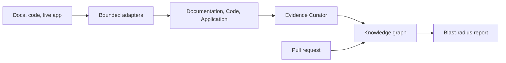

# Sentinel

Sentinel answers a narrow question: given product docs, a live application, its
source, and a real pull request, **what product behavior deserves regression
attention, and why?**

It connects documentation, observed UI, and implementation into an evidence
graph. When a PR lands, Sentinel traces changed symbols along evidence-backed
paths to screens, workflows, and requirements, then produces a blast-radius
report a QA lead can inspect — citations included, hidden model reasoning
excluded.

The reference slice is the
[mohit-nagaraj/Hi.Events](https://github.com/mohit-nagaraj/Hi.Events) fork,
[PR #1](https://github.com/mohit-nagaraj/Hi.Events/pull/1) (promo-code discount
type enum). Architecture, trust boundaries, and scope cuts live in
[DESIGN.md](DESIGN.md).

## Quick start

Node.js **22.17.0** (see `.nvmrc`) and pnpm **11.15.1** via Corepack. Default
tests and builds need no environment variables.

```sh
corepack enable
pnpm install --frozen-lockfile
pnpm demo:web
```

Open [http://localhost:3000](http://localhost:3000). `demo:web` uses an
in-memory fixture (`SENTINEL_CONTROL_PLANE_FIXTURE=1`): onboarding, run
activity, knowledge, and a sample assessment, with no auth or provider
credentials. Restart the process to reset fixture state.

| Route                                               | What to look at                                                   |
| --------------------------------------------------- | ----------------------------------------------------------------- |
| `/`                                                 | Bounded Hi.Events onboarding configuration                        |
| `/runs`                                             | Documentation, Code, Application, and Curator activity            |
| `/knowledge`                                        | Checkout coverage, an evidence path, and an explicit absence case |
| `/assessments/00000000-0000-4000-8000-000000000029` | Product report, evidence drill-down, download, and print          |

The committed [sample report](docs/delivery/sample-report-hi-events-pr-1338.md)
is the same product view rendered as Markdown. It is a deterministic fixture,
not a live model run or a browser-verified PR-head result.

## How it works

Models choose **where to look**. Deterministic code decides **what counts as
evidence**, what enters the graph, and what the report may claim.



Three specialists navigate prepared indexes. A Curator resolves conflicts and
gaps, then validators publish one application- and revision-scoped graph. PR
analysis starts from changed symbols and walks only evidence-backed paths.

The control plane is Next.js. Long work is a durable run, not a spinner. The
worker owns leases and graph execution; this repo does not ship the production
graph assembly, so the fixture demo does not start the worker.

## Workspace

| Path                     | Role                                     |
| ------------------------ | ---------------------------------------- |
| `apps/web`               | Next.js control plane                    |
| `apps/worker`            | Durable Node.js worker                   |
| `packages/contracts`     | Shared Zod schemas and identities        |
| `packages/adapters`      | Source, browser, and model adapters      |
| `packages/storage`       | Supabase / Neo4j operational storage     |
| `packages/orchestration` | LangGraph specialists and run graphs     |
| `packages/evaluation`    | Deterministic evaluation harness         |
| `docs`                   | Delivery, security, and evaluation notes |

## Commands

```sh
pnpm demo:web          # fixture UI, no credentials
pnpm test              # default unit / web / worker suite
pnpm delivery:check    # regenerate and lock the sample report
pnpm security          # secrets, licenses, and eval baseline gates
```

Opt-in suites stay separate: `pnpm test:integration`, `test:graph`,
`test:agent`, `test:browser`, and `test:live`. Integration and live tests skip
unless their disposable-service flags are set. See `.env.example`.

Format, lint, typecheck, and the full test matrix run in
[GitHub Actions](.github/workflows/ci.yml). Run them locally only when you
need that signal.

## Optional services

Copy `.env.example` to a local ignored file and fill **only** the providers you
intend to exercise. Each adapter fails closed when its config is absent. Never
commit the populated file.

| Service      | When you need it                                         |
| ------------ | -------------------------------------------------------- |
| Supabase     | Real control-plane persistence, Vault, private artifacts |
| Neo4j Aura   | Active knowledge graph (use a disposable database)       |
| Azure OpenAI | Provider-backed specialist runs                          |
| GitHub App   | PR webhooks and check runs                               |

Local Supabase already has `supabase/config.toml` and migrations — do not run
`supabase init`. Start with `pnpm dlx supabase@2.117.0 start`. Production
control-plane access also needs `SENTINEL_OPERATOR_TOKEN` and related server
settings from `.env.example`; do not enable the fixture flag in production.

The live Hi.Events demo (Railway + Supabase) used as a browser target is
documented in [deployment.md](deployment.md). That is the target app, not
Sentinel’s own host.

## Further reading

- [DESIGN.md](DESIGN.md) — architecture, graph semantics, evaluation, and
  next-week priorities
- [docs/delivery/sample-report-hi-events-pr-1338.md](docs/delivery/sample-report-hi-events-pr-1338.md)
  — committed product-rendered sample from upstream PR #1338
- [docs/evaluation/README.md](docs/evaluation/README.md) — harness protocol
- [docs/security/threat-model.md](docs/security/threat-model.md) — trust
  boundaries and demo limitations
- [docs/delivery/attribution.md](docs/delivery/attribution.md) — licenses and
  source attribution
