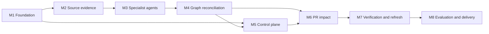

# Sentinel — Implementation Milestones

> Execution map derived from [`PRD.md`](./PRD.md). This file tracks outcomes and sequencing; implementation detail belongs in the issue files under [`.tasks/`](./.tasks/).

## How to use this plan

- Work in **dependency order**, not merely milestone-number order.
- Each issue is independently reviewable and includes its own tests.
- An issue is complete only when its acceptance criteria and required tests pass.
- Update issue status and the progress table whenever implementation state changes.
- Parallelize only issues whose dependencies are complete and whose write scopes do not overlap materially.
- Treat `PRD.md` as the product/architecture authority and [`decisions.md`](./decisions.md) as the decision rationale. Issue files define implementation scope, not new architecture.
- Unresolved deployment/model/registration inputs remain explicit blockers rather than being guessed.

## Status vocabulary

| Status        | Meaning                                                           |
| ------------- | ----------------------------------------------------------------- |
| `not-started` | Dependencies may or may not be satisfied; no implementation begun |
| `ready`       | All dependencies are complete and implementation can begin        |
| `in-progress` | One owner/agent is actively implementing it                       |
| `blocked`     | An external input or failed dependency prevents progress          |
| `review`      | Implementation and issue-level tests pass; awaiting review        |
| `done`        | Reviewed, accepted, and regression checks pass                    |

## Milestone dependency graph

---

## M1 — Foundation and durable execution

**Outcome:** A runnable TypeScript/Next.js + worker foundation with validated contracts, secure configuration, Supabase operational persistence, Neo4j connectivity, and durable LangGraph execution.

**Why first:** Every subsequent module depends on shared IDs/contracts, storage boundaries, run state, model access, and a test harness. Building feature agents before these contracts would create incompatible state and evidence shapes.

**Exit gate:** A synthetic graph can be queued, checkpointed in Supabase, interrupted/resumed, emit durable events, and read/write an isolated Neo4j test namespace without exposing secrets.

| ID      | Issue                                                                                                                                | Depends on                | Status |
| ------- | ------------------------------------------------------------------------------------------------------------------------------------ | ------------------------- | ------ |
| SNT-001 | [Workspace and testing foundation](./.tasks/milestone-01-foundation/SNT-001-workspace-testing-foundation.md)                         | —                         | done   |
| SNT-002 | [Core domain contracts and stable identity](./.tasks/milestone-01-foundation/SNT-002-core-contracts-stable-identity.md)              | SNT-001                   | done   |
| SNT-003 | [Supabase operational state, secrets, and artifact storage](./.tasks/milestone-01-foundation/SNT-003-supabase-operational-schema.md) | SNT-001, SNT-002          | done   |
| SNT-004 | [Neo4j constraints, repositories, and test isolation](./.tasks/milestone-01-foundation/SNT-004-neo4j-foundation.md)                  | SNT-001, SNT-002          | done   |
| SNT-005 | [Azure OpenAI model gateway compatibility spike](./.tasks/milestone-01-foundation/SNT-005-azure-model-gateway.md)                    | SNT-001, SNT-002          | done   |
| SNT-006 | [LangGraph runtime, checkpointing, events, and interrupts](./.tasks/milestone-01-foundation/SNT-006-langgraph-runtime.md)            | SNT-002, SNT-003, SNT-005 | done   |

---

## M2 — Deterministic source evidence

**Outcome:** Documentation, repository, TypeScript, PHP/Laravel, OpenAPI, PR diff, and browser substrates produce reproducible, provenance-rich facts without autonomous reasoning.

**Why separate from agents:** Deterministic substrates are independently testable. Specialist agents should navigate these facts rather than parse arbitrary raw inputs or receive broad filesystem/browser authority.

**Exit gate:** Pinned Hi.Events fixtures produce stable document sections, code symbols, endpoint mappings, changed-symbol mappings, browser states/actions/transitions, and private artifact references across repeated runs.

| ID      | Issue                                                                                                                                      | Depends on                | Status |
| ------- | ------------------------------------------------------------------------------------------------------------------------------------------ | ------------------------- | ------ |
| SNT-007 | [Read-only GitHub source connector and ephemeral checkout](./.tasks/milestone-02-source-evidence/SNT-007-github-source-connector.md)       | SNT-002, SNT-003          | done   |
| SNT-008 | [Documentation discovery, parsing, and provenance map](./.tasks/milestone-02-source-evidence/SNT-008-documentation-source-map.md)          | SNT-002, SNT-003, SNT-007 | done   |
| SNT-009 | [TypeScript and React structural indexer](./.tasks/milestone-02-source-evidence/SNT-009-typescript-react-indexer.md)                       | SNT-002, SNT-007          | done   |
| SNT-010 | [PHP and Laravel structural indexer](./.tasks/milestone-02-source-evidence/SNT-010-php-laravel-indexer.md)                                 | SNT-002, SNT-007          | done   |
| SNT-011 | [OpenAPI and cross-stack endpoint normalization](./.tasks/milestone-02-source-evidence/SNT-011-openapi-endpoint-normalization.md)          | SNT-009, SNT-010          | done   |
| SNT-012 | [Playwright observation, safe actions, and evidence capture](./.tasks/milestone-02-source-evidence/SNT-012-playwright-evidence-runtime.md) | SNT-002, SNT-003          | done   |
| SNT-013 | [PR diff to base/head symbol mapping](./.tasks/milestone-02-source-evidence/SNT-013-pr-diff-symbol-mapping.md)                             | SNT-007, SNT-009, SNT-010 | done   |

---

## M3 — Specialist discovery agents

**Outcome:** Three bounded LangGraph subgraphs iteratively navigate their deterministic evidence spaces and return typed, cited claims with explicit unresolved state.

**Why now:** Agent quality depends on the tools and evidence contracts in M2. This milestone proves agent behavior independently before cross-agent reconciliation or product UI integration.

**Exit gate:** Each specialist completes golden missions, obeys scope and budgets, rejects unsafe/unavailable tools, produces no uncited claims, and can checkpoint/resume without replaying unsafe effects.

| ID      | Issue                                                                                                        | Depends on                         | Status      |
| ------- | ------------------------------------------------------------------------------------------------------------ | ---------------------------------- | ----------- |
| SNT-014 | [Shared specialist agent kernel](./.tasks/milestone-03-specialist-agents/SNT-014-specialist-agent-kernel.md) | SNT-005, SNT-006                   | review      |
| SNT-015 | [Documentation Explorer agent](./.tasks/milestone-03-specialist-agents/SNT-015-documentation-explorer.md)    | SNT-008, SNT-014                   | not-started |
| SNT-016 | [Code Explorer agent](./.tasks/milestone-03-specialist-agents/SNT-016-code-explorer.md)                      | SNT-009, SNT-010, SNT-011, SNT-014 | done        |
| SNT-017 | [Application Explorer agent](./.tasks/milestone-03-specialist-agents/SNT-017-application-explorer.md)        | SNT-012, SNT-014                   | done        |

SNT-014 now provides the common specialist lifecycle and reviewed Code/Application compositions. SNT-015 begins after the kernel PR merges; SNT-018 waits for the completed Documentation specialist.

---

## M4 — Knowledge graph construction and reconciliation

**Outcome:** Specialist claims become validated evidence relationships, cross-layer gaps generate bounded follow-up missions, absence is modeled explicitly, and a current Neo4j graph is published atomically.

**Why this is the core milestone:** The assignment's value is not three independent agents; it is defensible traceability from product intent to runtime UI to code, including what could not be established.

**Exit gate:** A Hi.Events fixture yields at least one complete `DocumentSection → Requirement → Workflow → UIElement → APIEndpoint → CodeSymbol` path, one scoped coverage gap, and one Curator-driven follow-up mission, with no Tier-D claim entering confident traversal.

| ID      | Issue                                                                                                                                    | Depends on                         | Status      |
| ------- | ---------------------------------------------------------------------------------------------------------------------------------------- | ---------------------------------- | ----------- |
| SNT-018 | [Evidence validation, tiers, and candidate linking](./.tasks/milestone-04-graph-reconciliation/SNT-018-evidence-validation-linking.md)   | SNT-004, SNT-015, SNT-016, SNT-017 | not-started |
| SNT-019 | [Evidence Curator and bounded reconciliation](./.tasks/milestone-04-graph-reconciliation/SNT-019-evidence-curator.md)                    | SNT-014, SNT-018                   | not-started |
| SNT-020 | [Coverage assessments and absence semantics](./.tasks/milestone-04-graph-reconciliation/SNT-020-coverage-absence.md)                     | SNT-015, SNT-017, SNT-018          | not-started |
| SNT-021 | [Atomic current-graph publication and evidence queries](./.tasks/milestone-04-graph-reconciliation/SNT-021-graph-publication-queries.md) | SNT-004, SNT-018, SNT-019, SNT-020 | not-started |

---

## M5 — Onboarding and observable control plane

**Outcome:** A reviewer can connect Hi.Events through a real frontend, inspect compatibility, configure authentication/safety, initialize knowledge, watch all specialist lanes, review ambiguous links, and inspect evidence paths.

**Why after the engine:** The frontend should expose real run state and evidence contracts rather than simulate progress. API and UI work can begin from M1, but this milestone exits only against the complete knowledge workflow.

**Exit gate:** Refreshing the browser preserves run progress; private artifacts use authorized access; agent activity shows structured facts rather than chain-of-thought; a reviewer can approve/reject a pending link and resume the checkpointed run.

| ID      | Issue                                                                                                                                            | Depends on                                  | Status      |
| ------- | ------------------------------------------------------------------------------------------------------------------------------------------------ | ------------------------------------------- | ----------- |
| SNT-022 | [Application onboarding, compatibility, auth, and safety configuration](./.tasks/milestone-05-control-plane/SNT-022-onboarding-control-plane.md) | SNT-003, SNT-007, SNT-012                   | done        |
| SNT-023 | [Run APIs, worker control, cancellation, and recovery](./.tasks/milestone-05-control-plane/SNT-023-run-control-api.md)                           | SNT-006, SNT-022                            | not-started |
| SNT-024 | [Realtime specialist activity and screenshot storyboard](./.tasks/milestone-05-control-plane/SNT-024-agent-activity-ux.md)                       | SNT-006, SNT-017, SNT-023                   | not-started |
| SNT-025 | [Knowledge, coverage, evidence-path, and review UI](./.tasks/milestone-05-control-plane/SNT-025-knowledge-review-ui.md)                          | SNT-019, SNT-020, SNT-021, SNT-023, SNT-024 | not-started |

---

## M6 — Pull-request blast-radius product loop

**Outcome:** A GitHub App PR event or manual URL runs one idempotent assessment workflow, investigates changed implementation, computes explainable risk, publishes a QA-oriented report, and updates one GitHub check.

**Why independent of dynamic verification:** Static/graph-grounded blast-radius output is required and valuable even when no PR-head deployment exists. Verification enriches but does not gate this milestone.

**Exit gate:** A real public Hi.Events PR produces an immutable report with base/head identity, changed symbols, evidence paths, affected UI/workflows/requirements, unknowns, recommended tests, and a GitHub check linking to the dashboard.

| ID      | Issue                                                                                                                              | Depends on                                  | Status      |
| ------- | ---------------------------------------------------------------------------------------------------------------------------------- | ------------------------------------------- | ----------- |
| SNT-026 | [GitHub App webhook ingestion and check lifecycle](./.tasks/milestone-06-pr-impact/SNT-026-github-app-checks.md)                   | SNT-003, SNT-007, SNT-023                   | not-started |
| SNT-027 | [Agentic PR investigation workflow](./.tasks/milestone-06-pr-impact/SNT-027-pr-investigation-workflow.md)                          | SNT-013, SNT-016, SNT-019, SNT-021, SNT-026 | not-started |
| SNT-028 | [Blast-radius traversal, scoring, and unknown handling](./.tasks/milestone-06-pr-impact/SNT-028-blast-radius-engine.md)            | SNT-021, SNT-027                            | not-started |
| SNT-029 | [Grounded report generation, dashboard, and GitHub summary](./.tasks/milestone-06-pr-impact/SNT-029-assessment-report-delivery.md) | SNT-005, SNT-025, SNT-026, SNT-028          | not-started |

---

## M7 — Dynamic verification and knowledge refresh

**Outcome:** When a trusted PR-head deployment is supplied, Sentinel adaptively executes impacted flows with deterministic verdicts; after deployment, it refreshes only affected current knowledge without retaining stale active facts.

**Why later:** Preview hosting is unresolved and dynamic execution carries the highest safety and reproducibility risk. The assignment remains demonstrable through M6 if verification is explicitly unavailable.

**Exit gate:** A trusted fixture/head environment shows one affected flow and one control, setup is separated from behavior under test, observed results remain distinct from predicted risk, and a successful refresh advances the indexed commit atomically.

| ID      | Issue                                                                                                                                           | Depends on                                                    | Status      |
| ------- | ----------------------------------------------------------------------------------------------------------------------------------------------- | ------------------------------------------------------------- | ----------- |
| SNT-030 | [Trusted deployment identity and verification planning](./.tasks/milestone-07-verification-refresh/SNT-030-deployment-verification-planning.md) | SNT-022, SNT-027, SNT-028                                     | blocked     |
| SNT-031 | [Agentic targeted verification and deterministic verdicts](./.tasks/milestone-07-verification-refresh/SNT-031-agentic-targeted-verification.md) | SNT-017, SNT-024, SNT-029, SNT-030                            | not-started |
| SNT-032 | [Incremental post-deployment knowledge refresh](./.tasks/milestone-07-verification-refresh/SNT-032-incremental-knowledge-refresh.md)            | SNT-008, SNT-013, SNT-017, SNT-019, SNT-021, SNT-027, SNT-030 | not-started |

---

## M8 — Evaluation, hardening, and assignment delivery

**Outcome:** The system is demonstrably reproducible, safe, regression-tested, documented, and packaged with the design document, sample report, and Loom-ready path required by the assignment.

**Why last but not postponed:** Every earlier issue includes tests. This milestone builds the cross-stage golden dataset, repeated-run evaluation, threat/failure testing, final documentation, and polished demonstration—not a late attempt to add basic quality.

**Exit gate:** Clean setup succeeds from the README; full CI/regression/eval suite passes; the selected PR report is reproducible; mandatory assignment questions are answered; remaining limitations and next-week priorities are explicit.

| ID      | Issue                                                                                                                                    | Depends on                                  | Status      |
| ------- | ---------------------------------------------------------------------------------------------------------------------------------------- | ------------------------------------------- | ----------- |
| SNT-033 | [Golden dataset and stage/trajectory evaluation harness](./.tasks/milestone-08-evaluation-delivery/SNT-033-evaluation-harness.md)        | SNT-015, SNT-016, SNT-017, SNT-019, SNT-028 | not-started |
| SNT-034 | [Security, resilience, and regression hardening](./.tasks/milestone-08-evaluation-delivery/SNT-034-security-resilience-hardening.md)     | SNT-026, SNT-029, SNT-031, SNT-032, SNT-033 | not-started |
| SNT-035 | [README, design document, sample output, and Loom preparation](./.tasks/milestone-08-evaluation-delivery/SNT-035-assignment-delivery.md) | SNT-029, SNT-033, SNT-034                   | not-started |

---

## Global progress

| Milestone                                |   Done |  Total | Status                         |
| ---------------------------------------- | -----: | -----: | ------------------------------ |
| M1 Foundation and durable execution      |      6 |      6 | done                           |
| M2 Deterministic source evidence         |      7 |      7 | done                           |
| M3 Specialist discovery agents           |      2 |      4 | in-progress                    |
| M4 Graph construction and reconciliation |      0 |      4 | not-started                    |
| M5 Onboarding and control plane          |      1 |      4 | in-progress                    |
| M6 PR blast-radius loop                  |      0 |      4 | not-started                    |
| M7 Verification and refresh              |      0 |      3 | blocked on deployment decision |
| M8 Evaluation and delivery               |      0 |      3 | not-started                    |
| **Overall**                              | **16** | **35** | **in-progress**                |

## Active front

- SNT-014 is in review with implementation, QA, and P0/P1 code review complete; PR CI remains before merge.
- SNT-015 is the next specialist issue after SNT-014 merges.
- SNT-023 is the next ready control-plane issue after SNT-022 merges.
- External preparation can proceed without implementation ownership conflicts:
  - GitHub App registration inputs for SNT-026;
  - public baseline/head deployment decision for SNT-030.

## Next ready fronts after dependencies complete

These are not currently `ready`; they identify safe future parallelism:

- After **SNT-001 + SNT-002**: SNT-003 (Supabase), SNT-004 (Neo4j), and SNT-005 (Azure spike, once credentials exist) can proceed in parallel.
- After **SNT-003**: SNT-007 (GitHub source) and SNT-012 (Playwright substrate) can proceed in parallel; SNT-006 can proceed once SNT-005 is also complete.
- After **SNT-007**: SNT-008 (docs map), SNT-009 (TypeScript index), and SNT-010 (PHP index) can proceed in parallel.
- After **SNT-014 plus substrates**: SNT-015, SNT-016, and SNT-017 can proceed in parallel.
- Integrate/review those branches one issue at a time before starting SNT-018; do not let parallel agents redefine shared contracts independently.

## Required regression gates

Every issue runs its focused tests. At milestone boundaries, run the cumulative gates:

1. static formatting/linting and TypeScript type checks;
2. unit tests for contracts, parsers, policies, graph queries, and scoring;
3. integration tests against disposable Supabase schemas/buckets and isolated Neo4j application namespaces;
4. LangGraph whole-graph, node, partial-path, checkpoint/resume, interrupt, and budget tests;
5. Playwright component/browser tests with deterministic local fixtures;
6. GitHub webhook/check tests using signed recorded fixtures and mocked GitHub API responses;
7. golden-agent trajectory/evidence evaluations;
8. one opt-in live Hi.Events smoke path after all credentials/deployments are configured.

No issue may make the live, paid, or externally stateful tests part of the default fast unit suite.
